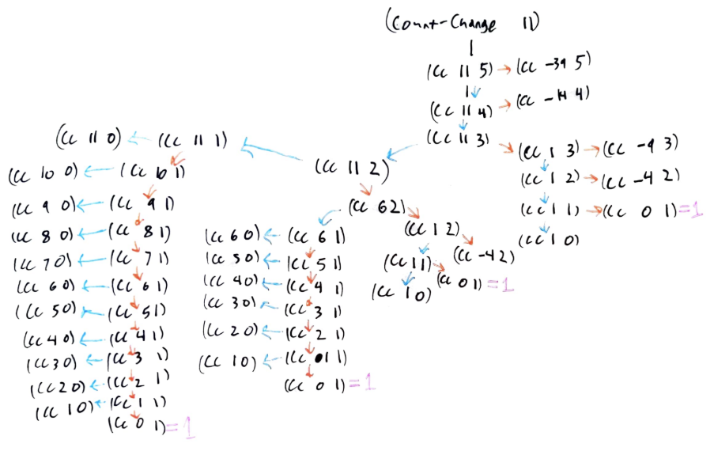
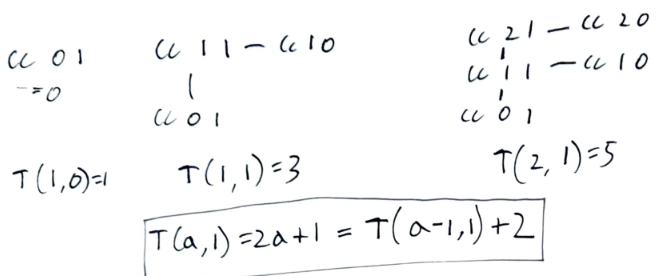
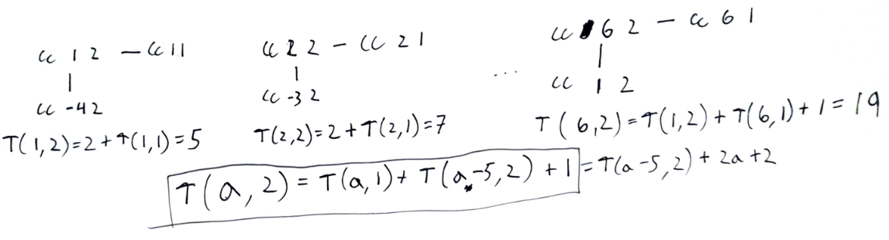

<div class="nav">
    <span class="activenav"><a href="notes-ch1-1.html">← Previous</a></span>
    <span class="activenav"><a href="../index.html">↑ Up</a></span>
    <span class="inactivenav">Next →</span>
</div>


[https://sarabander.github.io/sicp/html/1_002e2.xhtml](https://sarabander.github.io/sicp/html/1_002e2.xhtml)

## Section 1.2

### 1.2.1-1.2.2

- We distinguish between the *local evolution* and the *global behavior* of the process. It's easier to reason about the local evolution. 
- A linear recursive process is one that grows linearly at each step of the recursion. As an example, the naively implemented factorial using `(* n (factorial (- n 1)))` is
a linear recursive process.
- A linear iterative process is one that takes a number of steps that grows linearly with $n$. For example, the factorial defined using `(fact-iter (* n count) (- count 1))` is linear recursive.
- Using tail-recursion, we can specify "loop" constructs without using them explicitly. 
So what looks like a recursive implementation is in fact equivalent to an iterative loop like we might be familiar with in other languages.

### 1.2.3
 - We write that a positive function $R(n)$ is $\Theta(f(n))$ as $n\to\infty$ if...
$$\exists_{k_1,k_2,N}:\forall_{n\gt N}\;\; k_1 f(n)\leq R(n)\leq k_2 f(n)$$

Again, a footnote is critical here:
> These statements mask a great deal of oversimplification. For instance, if we count process steps as “machine operations” we are making the assumption that the number of machine operations needed to perform, say, a multiplication is independent of the size of the numbers to be multiplied, which is false if the numbers are sufficiently large. Similar remarks hold for the estimates of space. Like the design and description of a process, the analysis of a process can be carried out at various levels of abstraction.

So, you know, we aren't aiming for perfectly formal proofs that algorithms are of a certain order of growth, rather we want to
come up with heuristic arguments of our own and understand the heuristic arguments of others, using models of computation.

### 1.2.4
`fast-expt` is such a cool algorithm
```rkt
(define (even? n)
  (= (remainder n 2) 0))
(define (fast-expt b n)
  (cond ((= n 0) 
         1)
        ((even? n) 
         (square (fast-expt b (/ n 2))))
        (else 
         (* b (fast-expt b (- n 1))))))
```
Okay... in C this can be implemented easily as well as a recursive algorithm...
```c
int fastexpt(int b, int n){
    if(n==0)
        return 1;
    if(n%2==0){
        int k=fastexpt(b,n/2);
        return k*k;
    }
    return b*fastexpt(b,n-1);
}
```
The tricky thing is exercise 1.16 turning this into an iterative process.

### 1.2.5

Euclidean algorithm, also known as "a banger".

**Lamé’s Theorem:** If Euclid’s Algorithm requires $k$
 steps to compute the $\textrm{GCD}$ of some pair, then the smaller number in the pair must be greater than or equal to the $k^{th}$
 Fibonacci number.

> [43] This
> theorem was proved in 1845 by Gabriel Lamé, a French mathematician and
> engineer known chiefly for his contributions to mathematical physics. To prove
> the theorem, we consider pairs ${(a_k, b_k)}$, where ${a_k \ge b_k}$, 
> for which Euclid's Algorithm terminates in $k$ steps. The proof
> is based on the claim that, if ${(a_{k+1}, b_{k+1})} \to {(a_k, b_k)} \to {(a_{k-1}, b_{k-1})}$ 
> are three successive pairs 
> in the reduction process, then we must have $b_{k+1} \ge b_k + b_{k-1}$. 
> To verify the claim, consider that a reduction step is defined by applying the 
> transformation ${a_{k-1} = b_k}$, ${b_{k-1} =}$ remainder of $a_k$ 
> divided by $b_k$. The second equation means that $a_k = {qb_k} + {b_{k-1}}$ 
> for some positive integer $q$. And since $q$ must be at least 1 we have 
> $a_k = {qb_k} + b_{k-1} \ge b_k + b_{k-1}$. But in the previous reduction 
> step we have $b_{k+1} = a_k$. Therefore, $b_{k+1} = a_k \ge b_k + b_{k-1}$.
> This verifies the claim. Now we can prove the theorem by induction on $k$, 
> the number of steps that the algorithm requires to terminate. The result is true for 
> ${k = 1}$, since this merely requires that $b$ be at least as large as ${\text{Fib}(1) = 1}$. 
> Now, assume that the result is true for all integers less than or equal
> to $k$ and establish the result for ${k + 1}$. 
> Let ${(a_{k+1}, b_{k+1})} \to {(a_k, b_k)} \to {(a_{k-1}, b_{k-1})}$ 
> be successive pairs in the reduction 
> process. By our induction hypotheses, we have $b_{k-1} \ge {\text{Fib}(k - 1)}$ 
> and $b_k \ge {\text{Fib}(k)}$. Thus, applying the claim we just proved together with 
> the definition of the Fibonacci numbers gives 
> $b_{k+1} \ge b_k + b_{k-1} \ge {\text{Fib}(k)} + {\text{Fib}(k-1)} = {\text{Fib}(k+1)}$, 
> which completes the proof of Lamé's Theorem.

> [44] If d
 is a divisor of n
, then so is n/d
. But d
 and n/d
 cannot both be greater than n⎯⎯√
.

### 1.2.6

**Fermat's Little Theorem.** If $n$ is a prime number and $a$ is any positive integer 
less than $n,$ then $a^n\equiv a\textrm{ mod }n.$

Other algorithms worth implementing might be writing the digits of the decimal form of $1/a$ 
in base $b$. IIRC period of repetition is equal to $b^n \textrm{ mod }a.$ For example,
$10^n\textrm{ mod }7$ takes on six values, so $7^{-1}=0.\overline{142857}$ has period six.
Compare that to $10^n\textrm{ mod }11$ which only ever takes on values $1,10$. So $11^{-1}=0.\overline{09}$ has period two.

Another algorithm is the extended Euclidean algorithm, which actually finds the integers such that 
$ax+by=\textrm{gcd}(a,b).$ I've needed this a few times in Advent of Code problems.

It's tempting to mention continued fractions here, but they get their time in the limelight
in the next chapter.

### Appendices!

#### An aside on other asymptotic relations
 - First off, let's avoid the temptation to go Bourbaki style and get too into the weeds with definitions and equivalences and all that. It would be a colossal waste of time. Wikipedia does this a little bit. We want to just get the intention of the definitions and maybe a little bit of the formality.
 - Another book, "The Algorithm Design Manual" by Skiena, first defines $O(n)$ and $\Omega(n).$ For simplicity's sake we just care about the limit $n\to \infty$ and consider only positive functions $R(n).$

**Definition of $O(f(n))$:** We write that $R(n)$ is $O(f(n))$ as $n\to \infty$ if
$$\exists_{c,N}:\forall_{n\gt N}\;\; R(n)\leq c \cdot f(n)$$
$R(n)=O(f(n))$ is a statement that the growth rate of $f(n)$ times a constant is an upper bound on $R(n)$ for sufficiently large $n.$

**Definition of $\Omega(f(n))$:** We write that $R(n)$ is $\Omega(f(n))$ as $n\to\infty$ if
$$\exists_{c,N}:\forall_{n\gt N}\;\; 0 \leq c \cdot f(n) \leq R(n)$$
$R(n)=\Omega(f(n))$ is a statement that the growth rate of $f(n)$ times a constant is a lower bound on $R(n)$ for sufficiently large $n.$

Once we have those two definitions, something is $\Theta(f(n))$ if it is both $O(f(n))$ and $\Omega(f(n)).$

**Definition of $f(n)\gg g(n)$:** $f(n)\gg g(n)$ as $n\to a$ if $\lim_{n\to a} \frac{g(n)}{f(n)}=0.$ This definition gives:
$$n!\gg 2^n \gg n^3\gg n^2\gg n\log n\gg n\gg \log n \gg 1$$

**Definition of $f(n)\sim g(n)$:** $f(n)\sim g(n)$ as $n\to a$ if $\lim_{n\to a} \frac{g(n)}{f(n)}=1.$

#### An aside on asymptotic series
I have to write this because it's a physicist's bread and butter! For example, Stirling's formula is an asymptotic series, and in quantum field theories Feynman diagrams are used to calculate terms in an asymptotic series.

An asymptotic series is defined as follows. Note that this is an abuse of notation, and that *we never actually carry out the infinite sum*.

**Definition of $\sum_{i=1}^\infty f_i(n) \sim g(n)$:** We write $\sum_{i=1}^\infty f_i(n) \sim g(n)$ as $n\to a$ if:

 - $f_1(n)\sim g(n)$ as $n\to a$
 - The remainder is asymptotic to $f_2$: $g(n)-f_1(n)\sim f_2(n)$ as $n\to a$
 - That remainder is asymptotic to $f_3$: $g(n)-f_1(n)-f_2(n)\sim f_3(n)$, and so on $(\textrm{as }n\to a).$ 

For example, Stirling's formula can be written using this abuse of notation as:
$$\log(n!)\sim n\log(n)-n+\frac{1}{2}\log(2\pi n) + \sum_{k=2}^\infty \frac{(-1)^k B_k}{k(k-1)n^{k-1}}$$
The coefficients $B_k$ grow so rapidly that for any fixed $n$, the infinite sum doesn't converge! In fact we really mean to have an 
asymptotic relation. Another way of writing this is that for any fixed $M$ and as $n\to\infty:$
$$\log(n!)=n\log(n)-n+\frac{1}{2}\log(2\pi n) + \sum_{k=2}^M \frac{(-1)^k B_k}{k(k-1)n^{k-1}} + O\left(\frac{1}{n^M}\right)$$

There's another simpler example of asymptotic series that I really like. Say that you're stuck on a desert island and you have to compute $f(0.1)$, where $f$ is a transcendental function defined by the integral
$$f(a)=\int_0^\infty \frac{e^{-a x}}{1+x} \mathrm{d}x.$$
Well, let's use a series expansion and totally ignore issues of convergence and real analysis:
<p>$$\begin{align*}
\int_0^\infty \frac{e^{-a x}}{1+x} \mathrm{d}x &= \int_0^\infty e^{-x/a}\sum_{n=0}^\infty (-1)^n x^n \mathrm{d}x \\
&= \sum_{n=0}^\infty \int_0^\infty (-1)^n e^{-x/a} x^n \mathrm{d}x \\
&= \sum_{n=0}^\infty (-1)^n n!a^{n+1} \tag{integrate by parts}\\
\end{align*}$$</p>
This infinite sum has a radius of convergence of zero! However if we plug in $a=0.1$ and keep the first few terms, we get
$$f(0.1)\approx 0.1 - 0.01 + 0.002 - 0.0006 + 0.00024=0.09164$$
compared to the true value of $f(0.1)=0.0915633\ldots$

Really what we've proven is that
$$\int_0^\infty \frac{e^{-a x}}{1+x} \mathrm{d}x \sim \sum_{n=0}^\infty (-1)^n n!a^{n+1} \tag{as $a\to 0$}$$

TLDR this is the simplest example of coming up with an asymptotic series (as $a\to 0$) for a crazy integral.

I learned this from Bender and Orszag's "Advanced Mathematical Methods for Scientists and Engineers: Asymptotic Methods and Perturbation Theory". The title is a mouthful, and it comes across a lot better in video format. Carl Bender writes a lot of these equations with a smile on his face, because $\sum_{n-1}^\infty (-1)^n n!$ is an absurd sum and is kind of a joke! To a physicist or applied mathematician, what we mean by the infinite sum is really $f(1)$ where $f$ is the transcendental function defined above.

<iframe width="560" height="315" src="https://www.youtube.com/embed/LYNOGk3ZjFM?si=ulaELbRC-a_tg0VM" title="YouTube video player" frameborder="0" allow="accelerometer; autoplay; clipboard-write; encrypted-media; gyroscope; picture-in-picture; web-share" referrerpolicy="strict-origin-when-cross-origin" allowfullscreen></iframe>


### Exercises

#### Exercise 1.9

Each of the following two procedures defines a method for adding two positive integers in terms of the procedures inc, which increments its argument by 1, and dec, which decrements its argument by 1.

```rkt
(define (+ a b)
  (if (= a 0) 
      b 
      (inc (+ (dec a) b))))

(define (+ a b)
  (if (= a 0) 
      b 
      (+ (dec a) (inc b))))
```

Using the substitution model, illustrate the process generated by each procedure in evaluating `(+ 4 5)`. Are these processes iterative or recursive?

##### Solution
Using the first definition:

```rkt
; (define (+ a b)
;   (if (= a 0) 
;       b 
;       (inc (+ (dec a) b))))
(+ 4 5)
(inc (+ 3 5))
(inc (inc (+ 2 5)))
(inc (inc (inc (+ 1 5))))
(inc (inc (inc (inc (+ 0 5)))))
(inc (inc (inc (inc 5))))
(inc (inc (inc 6)))
(inc (inc 7))
(inc 8)
9
```

```rkt
; (define (+ a b)
;   (if (= a 0) 
;       b 
;       (+ (dec a) (inc b))))
(+ 4 5)
(+ 3 6)
(+ 2 7)
(+ 1 8)
(+ 0 9)
9
```

#### Exercise 1.10
The following procedure computes a mathematical function called Ackermann’s function.

```rkt
(define (A x y)
  (cond ((= y 0) 0)
        ((= x 0) (* 2 y))
        ((= y 1) 2)
        (else (A (- x 1)
                 (A x (- y 1))))))
```
What are the values of the following expressions?
```rkt
(A 1 10)
(A 2 4)
(A 3 3)
```
Consider the following procedures, where A is the procedure defined above:
```rkt
(define (f n) (A 0 n))
(define (g n) (A 1 n))
(define (h n) (A 2 n))
(define (k n) (* 5 n n))
```
Give concise mathematical definitions for the functions computed by the procedures f, g, and h for positive integer values of n. For example, `(k n)` computes $5n^2$.


##### Solution


@src(ch1-code/ex1-10.rkt)


For the first function,

```rkt
(A 0 n)
(cond ((= n 0) 0)
    ((= 0 0) (* 2 n))
    ((= n 1) 2)
    (else (A (- 0 1)
             (A x (- n 1)))))
; simplify assuming n >= 0
(* 2 n)
```

The second function,
```rkt
(A 1 n)
(cond ((= n 0) 0)
    ((= 1 0) (* 2 n))
    ((= n 1) 2)
    (else (A (- 1 1)
             (A 1 (- n 1)))))
; (A 1 0) is 0 
; (A 1 1) is 2
; (A 1 n) for n>=2 is 
; =(* 2 (A 1 (- n 1)))
; so (A 1 2) is (* 2 2)=4
; so (A 1 3) is (* 2 (* 2 2))=8
; so (A 1 n) is 2^n, simple proof by induction.
```

The third function,
```rkt
(A 2 n)
(cond ((= n 0) 0)
        ((= 2 0) (* 2 n))
        ((= n 1) 2)
        (else (A (- 2 1)
                 (A 2 (- n 1)))))
; (A 2 0) is 0
; (A 2 1) is 2
; (A 2 n) for n>=2 is
; =(A 1 (A 2 (- n 1)))
; =(pow 2 (A 2 (- n 1))) 
; eg. (A 2 2) is 2^2
; eg. (A 2 3) is 2^(2^2)
; eg. (A 2 4) is 2^(2^(2^2))
```
So This can be described with Knuth's up arrow notation, `(A 2 n)` is $2\uparrow \uparrow n$.


#### Exercise 1.11
A function $f$ is defined by the rule that $f(n)=n$ if $n\lt 3$ and $f(n)=f(n-1)+2f(n-2)+3f(n-3)$ if $n\geq 3.$ Write a procedure that computes $f$ by means of a recursive process. Write a procedure that computes $f$ by means of an iterative process.

##### Solution

@src(ch1-code/ex1-11a.rkt)

@src(ch1-code/ex1-11b.rkt)

#### Exercise 1.12
Write a recursive procedure that computes elements of Pascal's triangle.

##### Solution

The implementation of the procedure to compute the elements is just the first
function `choose`, the rest is just to make it print nicely!

@src(ch1-code/ex1-12.rkt)

#### Exercise 1.13
Prove that $\textrm{Fib}(n)$ is the closest integer to $\varphi^n/\sqrt{5}$ where $\varphi=(1+\sqrt{5})/2.$ Hint: Let $\psi=(1-\sqrt{5})/2.$ Use induction and the definition of the Fibonacci numbers to prove that $\textrm{Fib}(n)=(\varphi^n-\psi^n)/\sqrt{5}.$

##### Solution
First we prove that the formula gives the Fibonacci numbers:

**Base Cases.** Let's work out the first few base cases by hand to get a feel for it. 
$$f(0)=0,$$ 
$$f(1)=\frac{1+\sqrt{5}-1+\sqrt{5}}{2\sqrt{5}}=1,$$
$$f(2)=\frac{1+2\sqrt{5}+5-(1-2\sqrt{5}+5)}{4\sqrt{5}}=\frac{4\sqrt{5}}{4\sqrt{5}}=1,$$

**Inductive Step.** For the inductive step, we know the specific values of $\varphi$ and $\psi$ are important, so 
we'll write out the numerators and denominators explicitly. 


$$f(n)+f(n-1)=\frac{(1+\sqrt{5})^n-(1-\sqrt{5})^n}{2^n\sqrt{5}}+\frac{(1+\sqrt{5})^{n-1}-(1-\sqrt{5})^{n-1}}{2^{n-1}\sqrt{5}}$$

The first term can be expanded as 
$$\frac{(1+\sqrt{5})(1+\sqrt{5})^{n-1}-(1-\sqrt{5})(1-\sqrt{5})^{n-1}}{2^n\sqrt{5}}$$
The second as
$$\frac{2(1+\sqrt{5})^{n-1}-2(1-\sqrt{5})^{n-1}}{2^{n}\sqrt{5}}$$
Note also that $(1+\sqrt{5})^2=6+2\sqrt{5}=2(3+\sqrt{5})$ and $(1-\sqrt{5})^2=6-2\sqrt{5}=2(3-\sqrt{5}).$
Combining like terms gives:
<div>
$$\begin{align*}
f(n)+f(n-1)&=
\frac{(3+\sqrt{5})(1+\sqrt{5})^{n-1}-(3-\sqrt{5})(1-\sqrt{5})^{n-1}}{2^{n}\sqrt{5}}\\
&=\frac{\frac{1}{2}(1+\sqrt{5})^2(1+\sqrt{5})^{n-1}-\frac{1}{2}(1-\sqrt{5})^2(1-\sqrt{5})^{n-1}}{2^{n}\sqrt{5}}\\
&=\frac{(1+\sqrt{5})^{n+1}-(1-\sqrt{5})^{n+1}}{2^{n+1}\sqrt{5}}\\
&=\frac{\varphi^{n+1}+\psi^{n+1}}{\sqrt{5}}\\
&= f(n+1) &\square
\end{align*}$$
</div>

Next, we know that $\varphi^n/\sqrt{5}$ is always within a radius of $|\psi^n/\sqrt{5}|$ of an integer. But 
$|\psi^n/\sqrt{5}|$ is the monotonic decreasing sequence $\{0.27\ldots, 0.17\ldots, 0.10\ldots,\ldots\}$ 
so that already at $n=1$ the nearest integer to $\varphi^n/\sqrt{5}$ is equal to $f(n)$.

#### Exercise 1.14
Draw the tree illustrating the process generated by the `count-change` procedure of 1.2.2 in making change for 11 cents. What are the orders of growth of the space and number of steps used by this process as the amount to be changed increases?

##### Solution

<div style="text-align: center; margin: 20px 0;">
  
</div>

For the orders of growth, the memory growth is the simplest. The amount of space needed for the algorithm is the same order as the depth of the tree (to see this, I imagine traversing the tree from left to right, adding $0+0+\ldots$. At each point in the computation we have a cut somewhere down the middle of the tree, and this cut can only cut through at most $\Theta(\textrm{depth})$ etges). 

For the running time growth, I count the number of nodes in the graph. Denote this as $T(a,n)$ where $a$ is the amount we're adding up to and $n\in\{1,2,3,4,5\}$ is the number of types of coins we care about. $T(a,1)$ satisfies the recursion relation $T(a,1)=T(a-1,1)+2,$ so that $T(a,1)=2a+1.$
<div style="text-align: center; margin: 20px 0;">
  
</div>

$T(a,2)$ satisfies another recursion relation $T(a,2)=T(a-5,2)+T(a,1)+1,$ so that $T(a,2)=T(a-5,2)+2a+2.$
<div style="text-align: center; margin: 20px 0;">
  
</div>
Since this increases by $2a+2$ in strides of $5$, it is $\Theta(a^2).$ 

Similarly, $T(a,3)=T(a-10,3)+T(a,2)+1,$ which increases by an amount $\Theta(a^2)$ in strides of ten, so is $\Theta(a^3).$

In general, $T(a,n)=\Theta(a^n)$ and so our algorithm is of time complexity $\Theta(a^5).$ 

#### Exercise 1.15
The sine of an angle (specified in radians) can be computed by making use of the approximation $\sin x\approx x$
 if x
 is sufficiently small, and the trigonometric identity
$$ \sin x = 3 \sin \frac{x}{3}-4\sin^3\frac{x}{3}$$
to reduce the size of the argument of $\sin.$ (For purposes of this exercise an angle is considered “sufficiently small” if its magnitude is not greater than 0.1 radians.) These ideas are incorporated in the following procedures:

```rkt
(define (cube x) (* x x x))
(define (p x) (- (* 3 x) (* 4 (cube x))))
(define (sine angle)
   (if (not (> (abs angle) 0.1))
       angle
       (p (sine (/ angle 3.0)))))
```

1.How many times is the procedure `p` applied when `(sine 12.15)` is evaluated?

2.What is the order of growth in space and number of steps (as a function of $a$
) used by the process generated by the sine procedure when `(sine a)` is evaluated?

##### Solution
1. We want to solve for $12.15\times 3^{-n}=0.1$, so $n=\log(12.5/0.1)/\log(3)\approx 4.4.$ The function is evaluated five times. We might as well demonstrate this in code:
@src(ch1-code/ex1-15.rkt)

2. The number of steps is $\Theta(\log(a)).$ In space, the procedure is not quite tail 
recursive: we need to keep track of the number of calls to p, so we also require $\Theta(\log(a))$ in space.


#### Exercise 1.16
Design a procedure that evolves an iterative exponentiation process that uses successive squaring and uses a logarithmic number of steps, as does `fast-expt`. (Hint: Using the observation that $(b^{n/2})^2=(b^2)^{n/2},$
keep, along with the exponent $n$
 and the base $b,$
an additional state variable $a,$
and define the state transformation in such a way that the product $ab^n$
 is unchanged from state to state. At the beginning of the process $a$
 is taken to be $1,$ and the answer is given by the value of $a$
 at the end of the process. In general, the technique of defining an *invariant quantity* that remains unchanged from state to state is a powerful way to think about the design of iterative algorithms.)

##### Solution

This one always confuses the hell out of me! The key is that in the iteration function of three arguments, we change all three arguments. 

At each step, we either do:

* $a b^n = a (b^2)^{n/2}$, meaning we leave $a$ unchanged, we toss out $b$ and only consider $b^2$ from now on, and we consider $n/2$ from now on.

* $a b^n = (a b) b^{n-1}$, meaning we change $a$ to $(ab)$, we leave $b$ unchanged, and we only consider $n-1$ from now on.

@src(ch1-code/ex1-16.rkt)

<!--
not-so-great scratchwork:
For example, an iteration algorithm to compute `b^(2^n)` could be written as:
```rkt
; computes b^(2^n)
(define (b2n b n)
    (pow2-iter b b n))
(define (pow2-iter a b n)
  (cond ((= n 1) a)
        (else (pow2-iter (* a a) b (/ n 2)))))
```
But it could also be written by changing `b`:
```rkt
; computes b^(2^n)
(define (b2n b n)
    (pow2-iter b b n))
(define (pow2-iter a b n)
  (cond ((= n 1) a)
        (else (pow2-iter (* a a) b (/ n 2)))))
```

; computes b^(2^n)
(define (b2n b n)
    (pow2-iter b b n))
(define (pow2-iter a b n)
  (cond ((= n 1) a)
        (else (pow2-iter (* a a) b (/ n 2)))))

(b2n 3 1)
(b2n 3 2)
(b2n 3 4)
(b2n 3 8)
-->

#### Exercise 1.17
The exponentiation algorithms in this section are based on performing exponentiation by means of repeated multiplication. In a similar way, one can perform integer multiplication by means of repeated addition. The following multiplication procedure (in which it is assumed that our language can only add, not multiply) is analogous to the expt procedure:

```rkt
(define (* a b)
  (if (= b 0)
      0
      (+ a (* a (- b 1)))))
```

This algorithm takes a number of steps that is linear in `b`. Now suppose we include, together with addition, operations `double`, which doubles an integer, and `halve`, which divides an (even) integer by 2. Using these, design a multiplication procedure analogous to `fast-expt` that uses a logarithmic number of steps.

##### Solution
The $O(n)$ solution relies on rewriting $ab=a+a(b-1).$ So we probably want to do something like...

- $ab=(2a)(b/2)$ (if b is even)

- $ab=a+a(b-1)$ (if b is odd)

Here we see this computes `232*168` in ten steps.

@src(ch1-code/ex1-17.rkt)

And checking that zero is handled correctly:
@src(ch1-code/ex1-18a.rkt)

#### Exercise 1.18
Using the results of Exercise 1.16 and Exercise 1.17, devise a procedure that generates an iterative process for multiplying two integers in terms of adding, doubling, and halving and uses a logarithmic number of steps.

##### Solution

We'll work with an invariant $\textrm{prod}+ab.$ 

- If $b$ is even, we take $\textrm{prod}+(2a)(b/2).$ That is, $(\textrm{prod},a,b)\mapsto (\textrm{prod},2a,b/2).$

- If $b$ is odd, we take $\textrm{prod}+a+a(b-1).$ That is, $(\textrm{prod},a,b)\mapsto (\textrm{prod}+a,a,b-1).$

@src(ch1-code/ex1-18.rkt)

And let's just check that zero is handled correctly:
@src(ch1-code/ex1-18a.rkt)

#### Exercise 1.19
There is a clever algorithm for computing the Fibonacci numbers in a logarithmic number of steps. Recall the transformation of the state variables $a$ and $b$
 in the fib-iter process of 1.2.2: $a\leftarrow a+b$ and $b\leftarrow a.$
Call this transformation $T$
, and observe that applying $T$
 over and over again $n$
 times, starting with $1$ and $0,$ produces the pair $\textrm{Fib}(n+1)$ and $\textrm{Fib}(n).$ 
In other words, the Fibonacci numbers are produced by applying $T^n,$ the $n^{\textrm{th}}$
 power of the transformation $T$, starting with the pair $(1, 0).$
Now consider $T$ to be the special case of $p=0$ and $q=1$ in a family of transformations $T_{pq}$ where $T_{pq}$ transforms the pair $(a,b)$ according to
$a\leftarrow bq+aq+ap$ and $b\leftarrow bp+aq.$ Show that if we apply such a transformation 
$T_{pq}$ twice, the effect is the same as using a single transformation $T_{p'q'}$ of the same form,
and compute $p'$ and $q'$ in terms of $p$ and $q.$ This gives us an explicit way to 
square these transformations, and thus we can compute $T^n$ using successive squaring, as in the 
`fast-expt` procedure. Put this all together to complete the following procedure, which runs in
a logarithmic number of steps:


```rkt
(define (fib n)
  (fib-iter 1 0 0 1 n))

(define (fib-iter a b p q count)
  (cond ((= count 0) 
         b)
        ((even? count)
         (fib-iter a
                   b
                   ⟨??⟩  ;compute p'
                   ⟨??⟩  ;compute q'
                   (/ count 2)))
        (else 
         (fib-iter (+ (* b q) 
                      (* a q) 
                      (* a p))
                   (+ (* b p) 
                      (* a q))
                   p
                   q
                   (- count 1)))))
```

##### Solution

The rules are better written in matrix form:
$$T_{pq}=\begin{bmatrix} p+q & q \\\\ q & p \end{bmatrix}$$
$$T_{pq}\begin{bmatrix} a \\\\ b \end{bmatrix} = \begin{bmatrix} bq+aq+ap\\\\ bp+aq \end{bmatrix}$$

We have:
$$T_{pq}^2=\begin{bmatrix} p^2+2pq+2q^2 & 2pq+q^2 \\\\ 2pq+q^2 & p^2+q^2 \end{bmatrix}=T_{(p^2+q^2)(2pq+q^2)}$$

@src(ch1-code/ex1-19.rkt)


#### Exercise 1.20
The process that a procedure generates is of course dependent on the rules used by the interpreter. As an example, consider the iterative `gcd` procedure given above. Suppose we were to interpret this procedure using normal-order evaluation, as discussed in 1.1.5. (The normal-order-evaluation rule for if is described in Exercise 1.5.) Using the substitution method (for normal order), illustrate the process generated in evaluating `(gcd 206 40)` and indicate the remainder operations that are actually performed. How many remainder operations are actually performed in the normal-order evaluation of `(gcd 206 40)`? In the applicative-order evaluation?

##### Solution

###### Incorrect Solution 
Let's consider normal order first, since that's more difficult. 

I can think of a really silly way for normal order to work, but probably no interpreter would actually be stupid enough to do it like this. We could take "fully expand then reduce" to its extreme, and leave a whole bunch of unevaluated mods (written using "%" to make things less verbose!)
```rkt
(gcd 206 40)
(if (= 40 0) 206 (gcd 40 (% 206 40)))
(gcd 40 (% 206 40))
(if (= (% 206 40) 0) 40 (gcd (% 206 40) (% 40 (% 206 40)))
(if (= 6 0) 40 (gcd (% 206 40) (% 40 (% 206 40))) ; first eval
```
This would be extremely stupid, I mean, finding `(% 206 40)` everwhere wouldn't even be memoization. The function definition tells us where to place `b`. So instead, we shouldn't have this exponentially growing last argument, the evaluation will look like
```rkt
(gcd 206 40)
(if (= 40 0) 206 (gcd 40 (% 206 40)))
(gcd 40 (% 206 40))
(if (= (% 206 40) 0) 40 (gcd (% 206 40) (% 40 (% 206 40))))
(if (= 6 0) 40 (gcd 6 (% 40 6))) ; still counts as 1 eval
(gcd 6 (% 40 6)) 
(if (= (% 40 6) 0) 6 (gcd (% 40 6) (% 6 (% 40 6))))
(if (= 4 0) 6 (gcd 4 (% 6 4))) ; 1 eval
(gcd 4 (% 6 4))
(if (= (% 6 4) 0) 4 (gcd (% 6 4) (% 4 (% 6 4))))
(if (= 2 0) 4 (gcd 2 (% 4 2))) ; 1 eval
(if (= 0 0) 2 (gcd 0 (% 2 0))) ; 1 eval
```
So we need 4 evals. 

---

Okay, so that is precisely the wrong answer! We do the "extremely stupid" method. 

###### Correct Solution 
Firt off, applicative order uses four evaluations:
@src(ch1-code/ex1-20.rkt)

Next up, let's churn through applicative order and pray I don't make a typo. 
```rkt
(gcd 206 40)
(if (= 40 0) 206 (gcd 40 (% 206 40)))
(gcd 40 (% 206 40))
(if (= (% 206 40) 0) 40 (gcd (% 206 40) (% 40 (% 206 40)))
; first eval:
(if (= 6 0) 40 (gcd (% 206 40) (% 40 (% 206 40)))
(gcd (% 206 40) (% 40 (% 206 40))) 
; Next two evals:
(if (= (% 40 (% 206 40)) 0) (% 206 40) (gcd (% 40 (% 206 40)) (% (% 206 40) (% 40 (% 206 40)))))
; Next four evals (if statement evaluates to 2)
(if (= (% (% 206 40) (% 40 (% 206 40))) 0) (% 40 (% 206 40)) (gcd (% (% 206 40) (% 40 (% 206 40))) (% (% 40 (% 206 40)) (% (% 206 40) (% 40 (% 206 40))))))
; Next seven evals (if statement evaluates to 0.)
(if (= (% (% 40 (% 206 40)) (% (% 206 40) (% 40 (% 206 40)))) 0) (% (% 206 40) (% 40 (% 206 40))) (gcd b (% a b)))
; Next 4 evals
(% (% 206 40) (% 40 (% 206 40)))
2
```

So we have 1+2+4+7+4=18 evals. I also checked this with Mathematica which can have its behavior forced in various ways. This prints out 18:
```mathematica
counter=0;
mod[a_,b_]:=(counter++;Mod[a,b]);
gcd[a_,b_]:=If[b===0,a,gcd[Unevaluated[b],Unevaluated[mod[a,b]]]];
result=gcd[206,40];
counter
```


#### Exercise 1.21
Use the smallest-divisor procedure to find the smallest divisor of each of the following numbers: 199, 1999, 19999.

##### Solution

@src(ch1-code/ex1-21.rkt)

#### Exercise 1.22
Most Lisp implementations include a primitive called `runtime` that returns an integer that specifies the amount of time the system has been running (measured, for example, in microseconds). The following `timed-prime-test` procedure, when called with an integer $n,$
prints $n$
and checks to see if $n$
is prime. If $n$
is prime, the procedure prints three asterisks followed by the amount of time used in performing the test.

```rkt
(define (timed-prime-test n)
  (newline)
  (display n)
  (start-prime-test n (runtime)))
(define (start-prime-test n start-time)
  (if (prime? n)
      (report-prime (- (runtime) 
                       start-time))))
(define (report-prime elapsed-time)
  (display " *** ")
  (display elapsed-time))
```

Using this procedure, write a procedure `search-for-primes` that checks the
primality of consecutive odd integers in a specified range. Use your procedure
to find the three smallest primes larger than 1000; larger than 10,000; larger
than 100,000; larger than 1,000,000. Note the time needed to test each prime.
Since the testing algorithm has order of growth of
$\Theta\left(\sqrt{n}\right),$ you should expect that testing for primes around
10,000 should take about $\sqrt{10}$ times as long as testing for primes around
1000. Do your timing data bear this out? How well do the data for 100,000 and
1,000,000 support the $\Theta\left(\sqrt{n}\right)$ prediction? Is your result
compatible with the notion that programs on your machine run in time
proportional to the number of steps required for the computation?

##### Solution

I had to go to $10^8$ (22ms), $10^9$ (70ms), and $10^{10}$ (220ms) to get times above 1ms!

$22\sqrt{10}\approx 73.8,$ so we're right on the money.

@src(ch1-code/ex1-22a.rkt)


#### Exercise 1.23
The `smallest-divisor` procedure shown at the start of this section does lots of 
needless testing: After it checks to see if the number is divisible by 2 there
is no point in checking to see if it is divisible by any larger even numbers.
This suggests that the values used for `test-divisor` should not be 2, 3, 4, 5,
6, …, but rather 2, 3, 5, 7, 9, …. To implement this change, define a procedure
next that returns 3 if its input is equal to 2 and otherwise returns its input
plus 2. Modify the `smallest-divisor` procedure to use `(next test-divisor)`
instead of `(+ test-divisor 1)`. With `timed-prime-test` incorporating this
modified version of `smallest-divisor`, run the test for each of the 12 primes
found in Exercise 1.22. Since this modification halves the number of test
steps, you should expect it to run about twice as fast. Is this expectation
confirmed? If not, what is the observed ratio of the speeds of the two
algorithms, and how do you explain the fact that it is different from 2?

##### Solution

@src(ch1-code/ex1-23.rkt)

It's very closely within a factor of two, yep.
#### Exercise 1.24
Modify the `timed-prime-test` procedure of Exercise 1.22 to use
`fast-prime?` (the Fermat method), and test each of the 12 primes you found in
that exercise. Since the Fermat test has $\Theta(\log n)$ growth, how would you expect
the time to test primes near 1,000,000 to compare with the time needed to test
primes near 1000? Do your data bear this out? Can you explain any discrepancy
you find?

##### Solution
@src(ch1-code/ex1-24.rkt)

#### Exercise 1.25
Alyssa P. Hacker complains that we went to a lot of extra work in writing expmod. After all, she says, since we already know how to compute exponentials, we could have simply written

```rkt
(define (expmod base exp m)
  (remainder (fast-expt base exp) m))
```

Is she correct? Would this procedure serve as well for our fast prime tester? Explain.

#### Exercise 1.26
Louis Reasoner is having great difficulty doing Exercise 1.24. His
`fast-prime?` test seems to run more slowly than his `prime?` test. Louis calls
his friend Eva Lu Ator over to help. When they examine Louis’s code, they find
that he has rewritten the expmod procedure to use an explicit multiplication,
rather than calling square:

```rkt
(define (expmod base exp m)
  (cond ((= exp 0) 1)
        ((even? exp)
         (remainder 
          (* (expmod base (/ exp 2) m)
             (expmod base (/ exp 2) m))
          m))
        (else
         (remainder 
          (* base 
             (expmod base (- exp 1) m))
          m))))
```

“I don’t see what difference that could make,” says Louis. “I do.” says Eva.
“By writing the procedure like that, you have transformed the $\Theta(\log n)$ 
 process into a $\Theta( n)$
 process.” Explain.

#### Exercise 1.27
Demonstrate that the Carmichael numbers listed in Footnote 47 really do fool
the Fermat test. That is, write a procedure that takes an integer $n$ and tests
whether an is congruent to $a$ modulo $n$ for every $a\lt n,$ and try your procedure
on the given Carmichael numbers.

#### Exercise 1.28
One variant of the Fermat test that cannot be fooled is called the Miller-Rabin
test (Miller 1976; Rabin 1980). This starts from an alternate form of Fermat’s
Little Theorem, which states that if $n$ is a prime number and $a$ is any positive
integer less than $n,$ then $a^{n-1}\equiv 1\textrm{ mod }n.$ 

To test the primality of a number $n$ by the Miller-Rabin test, we
pick a random number $a\lt n$ and find $a^{n-1}\textrm{ mod }n$ using
the `expmod` procedure. However, whenever we perform the squaring step in `expmod`,
we check to see if we have discovered a “nontrivial square root of 1 modulo $n$
,” that is, a number not equal to 1 or $n−1$ whose square is equal to 1 modulo $n.$
It is possible to prove that if such a nontrivial square root of 1 exists,
then $n$ is not prime. It is also possible to prove that if $n$ is an odd number
that is not prime, then, for at least half the numbers $a\lt n$ , computing $a^{n−1}$
in this way will reveal a nontrivial square root of 1 modulo $n.$ (This is why
the Miller-Rabin test cannot be fooled.) Modify the expmod procedure to signal
if it discovers a nontrivial square root of 1, and use this to implement the
Miller-Rabin test with a procedure analogous to `fermat-test`. Check your
procedure by testing various known primes and non-primes. Hint: One convenient
way to make `expmod` signal is to have it return 0.

Test
