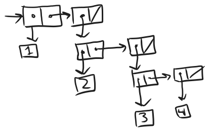

<div class="nav">
    <span class="activenav"><a href="notes-ch2-1.html">← Previous</a></span>
    <span class="activenav"><a href="../index.html">↑ Up</a></span>
    <span class="activenav"><a href="notes-ch2-3.html">Next →</a></span>
</div>

[HTML Book Chapter 2.2 Link](https://sarabander.github.io/sicp/html/2_002e2.xhtml#g_t2_002e2)

@toc

## Section 2.2

### Experiments with lists and nil

@src(code/ch2-2-experiments.rkt)

### Other stuff I should know:

atom?

number?

```

; 'symb
; ; (list symb)
; '(symb)
; (map (lambda (x) (list x)) (list 1 2 3 4))

;; Some discussion leading into symbolics/undefined symbol f.
(define lst (list 1 2 3 4))
(map (lambda (x) ('f x)) lst)
(list (quote (f 1)) (quote (f 2)) (quote (f 3)) (quote (f 4)))
(map (lambda (x) `(f ,x)) lst)
```

### Experiments with binary trees
- Note to self: do some enumeration of binary trees here! It'll be fun!

### Meeting 04-06-2025

Note:

 - wanna do problems 2.44-2.52 when I have more Racket experience
 - What does the n-queens generating function look like? Can we resum it?
 - Other drawing ideas: L-systems
 - 

### Exercises

##### Solution

#### Exercise 2.17

Define a procedure
`last-pair` that returns the list that contains only the last element of a
given (nonempty) list:

```rkt
(last-pair (list 23 72 149 34))
(34)
```

##### Solution

@src(code/ex2-17.rkt)

#### Exercise 2.18

Define a procedure `reverse`
that takes a list as argument and returns a list of the same elements in
reverse order:

```rkt
(reverse (list 1 4 9 16 25))
(25 16 9 4 1)
```

##### Solution

@src(code/ex2-18.rkt)

> “What else are lists,” you reply, your eyes flashing, “But alternatives?”

https://aphyr.com/posts/340-reversing-the-technical-interview

#### Exercise 2.19

Consider the change-counting
program of 1.2.2.  It would be nice to be able to easily change
the currency used by the program, so that we could compute the number of ways
to change a British pound, for example.  As the program is written, the
knowledge of the currency is distributed partly into the procedure
`first-denomination` and partly into the procedure `count-change`
(which knows that there are five kinds of U.S. coins).  It would be nicer to be
able to supply a list of coins to be used for making change.

We want to rewrite the procedure `cc` so that its second argument is a
list of the values of the coins to use rather than an integer specifying which
coins to use.  We could then have lists that defined each kind of currency:

```rkt
(define us-coins 
  (list 50 25 10 5 1))

(define uk-coins 
  (list 100 50 20 10 5 2 1 0.5))
```

We could then call `cc` as follows:

```rkt
(cc 100 us-coins)
292
```

To do this will require changing the program `cc` somewhat.  It will still
have the same form, but it will access its second argument differently, as
follows:

```rkt
(define (cc amount coin-values)
  (cond ((= amount 0) 
         1)
        ((or (< amount 0) 
             (no-more? coin-values)) 
         0)
        (else
         (+ (cc 
             amount
             (except-first-denomination 
              coin-values))
            (cc 
             (- amount
                (first-denomination 
                 coin-values))
             coin-values)))))
```

Define the procedures `first-denomination`,
`except-first-denomination` and `no-more?` in terms of primitive
operations on list structures.  Does the order of the list `coin-values`
affect the answer produced by `cc`?  Why or why not?

##### Solution
@src(code/ex2-19.rkt)
Pretty simple definitions, and we've demonstrated that the order doesn't matter.

#### Exercise 2.20

The procedures `+`,
`*`, and `list` take arbitrary numbers of arguments. One way to
define such procedures is to use `define` with dotted-tail notation.  
In a procedure definition, a parameter list that has a dot before
the last parameter name indicates that, when the procedure is called, the
initial parameters (if any) will have as values the initial arguments, as
usual, but the final parameter's value will be a list of any
remaining arguments.  For instance, given the definition

```rkt
(define (f x y . z) ⟨body⟩)
```


the procedure `f` can be called with two or more arguments.  If we
evaluate

```rkt
(f 1 2 3 4 5 6)
```


then in the body of `f`, `x` will be 1, `y` will be 2, and
`z` will be the list `(3 4 5 6)`.  Given the definition

```rkt
(define (g . w) ⟨body⟩)
```


the procedure `g` can be called with zero or more arguments.  If we
evaluate

```rkt
(g 1 2 3 4 5 6)
```


then in the body of `g`, `w` will be the list `(1 2 3 4 5
6)`.

Use this notation to write a procedure `same-parity` that takes one or
more integers and returns a list of all the arguments that have the same
even-odd parity as the first argument.  For example,

```rkt
(same-parity 1 2 3 4 5 6 7)
(1 3 5 7)

(same-parity 2 3 4 5 6 7)
(2 4 6)
```

##### Solution

@src(code/ex2-20.rkt)

#### Exercise 2.21

The procedure `square-list`
takes a list of numbers as argument and returns a list of the squares of those
numbers.

```rkt
(square-list (list 1 2 3 4))
(1 4 9 16)
```

Here are two different definitions of `square-list`.  Complete both of
them by filling in the missing expressions:

```rkt
(define (square-list items)
  (if (null? items)
      nil
      (cons ⟨??⟩ ⟨??⟩)))

(define (square-list items)
  (map ⟨??⟩ ⟨??⟩))
```

##### Solution

@src(code/ex2-21.rkt)

#### Exercise 2.22

Louis Reasoner tries to rewrite
the first `square-list` procedure of Exercise 2.21 so that it
evolves an iterative process:

```rkt
(define (square-list items)
  (define (iter things answer)
    (if (null? things)
        answer
        (iter (cdr things)
              (cons (square (car things))
                    answer))))
  (iter items nil))
```

Unfortunately, defining `square-list` this way produces the answer list in
the reverse order of the one desired.  Why?

Louis then tries to fix his bug by interchanging the arguments to `cons`:

```rkt
(define (square-list items)
  (define (iter things answer)
    (if (null? things)
        answer
        (iter (cdr things)
              (cons answer
                    (square 
                     (car things))))))
  (iter items nil))
```

This doesn't work either.  Explain.

##### Solution

This doesn't work, because it's a depth-first list! 
```rkt
;; We want this:
(cons 1 (cons 4 (cons 9 (cons 16 nil))))
;; We get this:
(cons (cons (cons (cons nil 1) 4) 9) 16)
```

I solved this in 2.22 by doing the first method and adding a reverse, which is another O(n) operation but it's only called once, so the entire method is still only O(n).

Checking:
@src(code/ex2-22.rkt)

#### Exercise 2.23

The procedure `for-each` is
similar to `map`.  It takes as arguments a procedure and a list of
elements.  However, rather than forming a list of the results, `for-each`
just applies the procedure to each of the elements in turn, from left to right.
The values returned by applying the procedure to the elements are not used at
all---`for-each` is used with procedures that perform an action, such as
printing.  For example,

```rkt
(for-each 
 (lambda (x) (newline) (display x))
 (list 57 321 88))

57
321
88
```

The value returned by the call to `for-each` (not illustrated above) can
be something arbitrary, such as true.  Give an implementation of
`for-each`.

##### Solution

@src(code/ex2-23.rkt)

#### Exercise 2.24

Suppose we evaluate the
expression `(list 1 (list 2 (list 3 4)))`.  Give the result printed by the
interpreter, the corresponding box-and-pointer structure, and the
interpretation of this as a tree (as in Figure 2.6).

##### Solution

<div style="text-align: center; margin: 20px 0;">
  
</div>
To view this as a tree, tilt your head 45 degrees.

This should print out `(1 (2 (3 4)))`?

@src(code/ex2-24.rkt)

#### Exercise 2.25

Give combinations of `car`s
and `cdr`s that will pick 7 from each of the following lists:

```rkt
(1 3 (5 7) 9)
((7))
(1 (2 (3 (4 (5 (6 7))))))
```

##### Solution

Got it right in one try btw, B)

@src(code/ex2-25.rkt)

#### Exercise 2.26

Suppose we define `x` and
`y` to be two lists:

```rkt
(define x (list 1 2 3))
(define y (list 4 5 6))
```

What result is printed by the interpreter in response to evaluating each of the
following expressions:

```rkt
(append x y)
(cons x y)
(list x y)
```

##### Solution

Expected answer:
```rkt
(1 2 3 4 5 6)
((1 2 3) . (4 5 6))
((1 2 3) (4 5 6))
```

@src(code/ex2-26.rkt)

Ok, dang I got the middle list wrong! That does make sense though, the structure is

`(c (c 1 (c 2 (c 3 nil))) (c 4 (c 5 (c 6 nil))))`

which is a list with a list as its first element, and the elements 4,5,6 as the rest of it.

#### Exercise 2.27

Modify your `reverse`
procedure of Exercise 2.18 to produce a `deep-reverse` procedure
that takes a list as argument and returns as its value the list with its
elements reversed and with all sublists deep-reversed as well.  For example,

```rkt
(define x 
  (list (list 1 2) (list 3 4)))

x
((1 2) (3 4))

(reverse x)
((3 4) (1 2))

(deep-reverse x)
((4 3) (2 1))
```

##### Solution

@src(code/ex2-27.rkt)

#### Exercise 2.28

Write a procedure `fringe`
that takes as argument a tree (represented as a list) and returns a list whose
elements are all the leaves of the tree arranged in left-to-right order.  For
example,

```rkt
(define x 
  (list (list 1 2) (list 3 4)))

(fringe x)
(1 2 3 4)

(fringe (list x x))
(1 2 3 4 1 2 3 4)
```

##### Solution
Very straightforward as a recursive procedure using append.
The fringe of a list is the fringe of the elements of the list appended in order.
@src(code/ex2-28.rkt)

#### Exercise 2.29

A binary mobile consists of two
branches, a left branch and a right branch.  Each branch is a rod of a certain
length, from which hangs either a weight or another binary mobile.  We can
represent a binary mobile using compound data by constructing it from two
branches (for example, using `list`):

```rkt
(define (make-mobile left right)
  (list left right))
```

A branch is constructed from a `length` (which must be a number) together
with a `structure`, which may be either a number (representing a simple
weight) or another mobile:

```rkt
(define (make-branch length structure)
  (list length structure))
```

**1.** Write the corresponding selectors `left-branch` and `right-branch`,
which return the branches of a mobile, and `branch-length` and
`branch-structure`, which return the components of a branch.

**2.** Using your selectors, define a procedure `total-weight` that returns the
total weight of a mobile.

**3.** A mobile is said to be balanced if the torque applied by its top-left
branch is equal to that applied by its top-right branch (that is, if the length
of the left rod multiplied by the weight hanging from that rod is equal to the
corresponding product for the right side) and if each of the submobiles hanging
off its branches is balanced. Design a predicate that tests whether a binary
mobile is balanced.

**4.** Suppose we change the representation of mobiles so that the constructors are

```rkt
(define (make-mobile left right)
  (cons left right))

(define (make-branch length structure)
  (cons length structure))
```

How much do you need to change your programs to convert to the new
representation?

##### Solution

@src(code/ex2-29.rkt)

For part 4, we just need to change the functions with car and cdr in them. Pretty trivial.
```rkt
(define (left-branch mobile) (car mobile))
(define (right-branch mobile) (cdr mobile))
(define (branch-length branch) (car branch))
(define (branch-mobile branch) (cdr branch))
```

#### Exercise 2.30

Define a procedure
`square-tree` analogous to the `square-list` procedure of
Exercise 2.21.  That is, `square-tree` should behave as follows:

```rkt
(square-tree
 (list 1
       (list 2 (list 3 4) 5)
       (list 6 7)))
(1 (4 (9 16) 25) (36 49))
```

Define `square-tree` both directly (i.e., without using any higher-order
procedures) and also by using `map` and recursion.

##### Solution

@src(code/ex2-30.rkt)

#### Exercise 2.31

Abstract your answer to
Exercise 2.30 to produce a procedure `tree-map` with the property
that `square-tree` could be defined as

```rkt
(define (square-tree tree) 
  (tree-map square tree))
```

##### Solution

@src(code/ex2-31.rkt)

#### Exercise 2.32

We can represent a set as a list
of distinct elements, and we can represent the set of all subsets of the set as
a list of lists.  For example, if the set is `(1 2 3)`, then the set of
all subsets is `(() (3) (2) (2 3) (1) (1 3) (1 2) (1 2 3))`.  Complete the
following definition of a procedure that generates the set of subsets of a set
and give a clear explanation of why it works:

```rkt
(define (subsets s)
  (if (null? s)
      (list nil)
      (let ((rest (subsets (cdr s))))
        (append rest (map ⟨??⟩ rest)))))
```

##### Solution

When we call `append rest (...)`, `rest` is the list of sets where we don't 
take the current element (`car s`), and we want to fill in (...) with the list of sets where we do take the current element. We achieve this with a lambda.

@src(code/ex2-32.rkt)

#### Exercise 2.33

Fill in the missing expressions
to complete the following definitions of some basic list-manipulation
operations as accumulations:

```rkt
(define (map p sequence)
  (accumulate (lambda (x y) ⟨??⟩) 
              nil sequence))

(define (append seq1 seq2)
  (accumulate cons ⟨??⟩ ⟨??⟩))

(define (length sequence)
  (accumulate ⟨??⟩ 0 sequence))
```

##### Solution

@src(code/ex2-33.rkt)

#### Exercise 2.34

Evaluating a polynomial in $x$
at a given value of $x$ can be formulated as an accumulation.  We evaluate
the polynomial

$${a_n x^n} + {a_{n-1} x^{n-1}} + \dots + {a_1 x} + a_0  $$


using a well-known algorithm called Horner's rule, which structures
the computation as

$${(\dots (a_n x} + {a_{n-1}) x} + \dots + {a_1) x} + {a_0.}  $$


In other words, we start with $a_n$, multiply by $x$, add
$a_{n-1}$, multiply by $x$, and so on, until we reach
$a_0$.

Fill in the following template to produce a procedure that evaluates a
polynomial using Horner's rule.  Assume that the coefficients of the polynomial
are arranged in a sequence, from $a_0$ through $a_n$.

```rkt
(define 
  (horner-eval x coefficient-sequence)
  (accumulate 
   (lambda (this-coeff higher-terms)
     ⟨??⟩)
   0
   coefficient-sequence))
```

For example, to compute ${1 + 3x + {5x^3 + x^5}}$ at ${x = 2}$ you
would evaluate

```rkt
(horner-eval 2 (list 1 3 0 5 0 1))
```

##### Solution
@src(code/ex2-34.rkt)

#### Exercise 2.35

Redefine `count-leaves` from
2.2.2 as an accumulation:

```rkt
(define (count-leaves t)
  (accumulate ⟨??⟩ ⟨??⟩ (map ⟨??⟩ ⟨??⟩)))
```

##### Solution

@src(code/ex2-35.rkt)

#### Exercise 2.36

The procedure `accumulate-n`
is similar to `accumulate` except that it takes as its third argument a
sequence of sequences, which are all assumed to have the same number of
elements.  It applies the designated accumulation procedure to combine all the
first elements of the sequences, all the second elements of the sequences, and
so on, and returns a sequence of the results.  For instance, if `s` is a
sequence containing four sequences, `((1 2 3) (4 5 6) (7 8 9) (10 11
12)),` then the value of `(accumulate-n + 0 s)` should be the sequence
`(22 26 30)`.  Fill in the missing expressions in the following definition
of `accumulate-n`:

```rkt
(define (accumulate-n op init seqs)
  (if (null? (car seqs))
      nil
      (cons (accumulate op init ⟨??⟩)
            (accumulate-n op init ⟨??⟩))))
```

##### Solution
@src(code/ex2-36.rkt)
#### Exercise 2.37

Suppose we represent vectors $\mathbf v = (v_i)$ as sequences of numbers, and
matrices $\mathbf m=(m_{ij})$ as sequences of vectors (the rows of the
matrix).  For example, the matrix

$$\left(\matrix{	1 & 2 & 3 & 4 \cr
		4 & 5 & 6 & 6 \cr
		6 & 7 & 8 & 9 \cr }\right)  $$


is represented as the sequence `((1 2 3 4) (4 5 6 6) (6 7 8 9))`.  With
this representation, we can use sequence operations to concisely express the
basic matrix and vector operations.  These operations (which are described in
any book on matrix algebra) are the following:

<div>$$\begin{align*}
	\text{(dot-product v w)} 	&\quad \text{returns the sum}\;\Sigma_i v_i w_i; \cr
	\text{(matrix-*-vector m v)} 	&\quad \text{returns the vector}\;{\bf t}, \cr
		&\quad \text{where}\; t_i = \Sigma_j m_{ij} v_j; \cr
	\text{(matrix-*-matrix m n)} 	&\quad \text{returns the matrix}\;{\bf p}, \cr
		&\quad \text{where}\; p_{ij} = \Sigma_k m_{ik} n_{kj}; \cr
	\text{(transpose m)} 		&\quad \text{returns the matrix}\;{\bf n}, \cr
		&\quad \text{where}\; n_{ij} = m_{ji}. \cr
\end{align*}$$</div>

We can define the dot product as

```rkt
(define (dot-product v w)
  (accumulate + 0 (map * v w)))
```

Fill in the missing expressions in the following procedures for computing the
other matrix operations.  (The procedure `accumulate-n` is defined in
Exercise 2.36.)

```rkt
(define (matrix-*-vector m v)
  (map ⟨??⟩ m))

(define (transpose mat)
  (accumulate-n ⟨??⟩ ⟨??⟩ mat))

(define (matrix-*-matrix m n)
  (let ((cols (transpose n)))
    (map ⟨??⟩ m)))
```

##### Solution

@src(code/ex2-37.rkt)

#### Exercise 2.38

The `accumulate` procedure
is also known as `fold-right`, because it combines the first element of
the sequence with the result of combining all the elements to the right.  There
is also a `fold-left`, which is similar to `fold-right`, except that
it combines elements working in the opposite direction:

```rkt
(define (fold-left op initial sequence)
  (define (iter result rest)
    (if (null? rest)
        result
        (iter (op result (car rest))
              (cdr rest))))
  (iter initial sequence))
```

What are the values of

```rkt
(fold-right / 1 (list 1 2 3))
(fold-left  / 1 (list 1 2 3))
(fold-right list nil (list 1 2 3))
(fold-left  list nil (list 1 2 3))
```

Give a property that `op` should satisfy to guarantee that
`fold-right` and `fold-left` will produce the same values for any
sequence.

##### Solution
```rkt
(fold-right / 1 (list 1 2 3))
  (/ 3 1)
  (/ 2 3)
  (/ 1 2/3)
  =3/2
(fold-left  / 1 (list 1 2 3))
  (/ 1 1)
  (/ 1 2)
  (/ 1/2 3)
  =1/6
(fold-right list nil (list 1 2 3))
  (list 3 nil)
  (list 2 (list 3 nil))
  = (list 1 (list 2 (list 3 nil)))
(fold-left  list nil (list 1 2 3))
  (list nil 1 )
  (list (list nil 1) 2)
  =(list (list (list nil 1) 2) 3)
```
@src(code/ex2-38.rkt)

We want associativity. In lispy form:
`(op (op a b) c) == (op a (op b c))`

I'm not going to write up a totally formal proof, but we can consider the following two statements and do induction on n.
```
(fold-right op i (list a1 a2 ... an))
=(op a1 (fold-right op i (list a2 ... an))

(fold-left op i (list a1 a2 ... an))
=(iter i (list a1 a2 ... an))
=(iter (op i a1) (list a2 ... an))
```

#### Exercise 2.39

Complete the following
definitions of `reverse` (Exercise 2.18) in terms of
`fold-right` and `fold-left` from Exercise 2.38:

```rkt
(define (reverse sequence)
  (fold-right 
   (lambda (x y) ⟨??⟩) nil sequence))

(define (reverse sequence)
  (fold-left 
   (lambda (x y) ⟨??⟩) nil sequence))
```

##### Solution

This one always gets me. In the book's definition of fold-left, we already
swap the order of result and `car rest`. ie, in the definition of fold-left the first op that is evaluated is `(op nil (first-elem))` whereas in fold-right 
it's `(op (last-elem) nil)`. I always end up double-swapping. 

@src(code/ex2-39.rkt)

#### Exercise 2.40

Define a procedure
`unique-pairs` that, given an integer $n$, generates the sequence of
pairs ${(i, j)}$ with ${1 \le j \lt {i \le n}}$.  Use `unique-pairs`
to simplify the definition of `prime-sum-pairs` given above.

##### Solution
The scaffolding code is a bit much, we might have to start actually including a library file! Regardless...

@src(code/ex2-40.rkt)

#### Exercise 2.41

Write a procedure to find all
ordered triples of distinct positive integers $i$, $j$, and $k$ less than
or equal to a given integer $n$ that sum to a given integer $s$.

##### Solution
Should we write this a clever way?
@src(code/ex2-41.rkt)

#### Exercise 2.42

The eight-queens puzzle asks
how to place eight queens on a chessboard so that no queen is in check from any
other (i.e., no two queens are in the same row, column, or diagonal).  One
possible solution is shown in Figure 2.8.  One way to solve the puzzle is
to work across the board, placing a queen in each column.  Once we have placed
${k - 1}$ queens, we must place the $k^{\text{th}}$ queen in a position where it does
not check any of the queens already on the board.  We can formulate this
approach recursively: Assume that we have already generated the sequence of all
possible ways to place ${k - 1}$ queens in the first ${k - 1}$ columns of the
board.  For each of these ways, generate an extended set of positions by
placing a queen in each row of the $k^{\text{th}}$ column.  Now filter these, keeping
only the positions for which the queen in the $k^{\text{th}}$ column is safe with
respect to the other queens.  This produces the sequence of all ways to place
$k$ queens in the first $k$ columns.  By continuing this process, we will
produce not only one solution, but all solutions to the puzzle.

We implement this solution as a procedure `queens`, which returns a
sequence of all solutions to the problem of placing $n$ queens on an
${n \times n}$ chessboard.  `Queens` has an internal procedure
`queen-cols` that returns the sequence of all ways to place queens in the
first $k$ columns of the board.

```rkt
(define (queens board-size)
  (define (queen-cols k)
    (if (= k 0)
        (list empty-board)
        (filter
         (lambda (positions) 
           (safe? k positions))
         (flatmap
          (lambda (rest-of-queens)
            (map (lambda (new-row)
                   (adjoin-position 
                    new-row 
                    k 
                    rest-of-queens))
                 (enumerate-interval 
                  1 
                  board-size)))
          (queen-cols (- k 1))))))
  (queen-cols board-size))
```

In this procedure `rest-of-queens` is a way to place ${k - 1}$ queens in
the first ${k - 1}$ columns, and `new-row` is a proposed row in which to
place the queen for the $k^{\text{th}}$ column.  Complete the program by implementing
the representation for sets of board positions, including the procedure
`adjoin-position`, which adjoins a new row-column position to a set of
positions, and `empty-board`, which represents an empty set of positions.
You must also write the procedure `safe?`, which determines for a set of
positions, whether the queen in the $k^{\text{th}}$ column is safe with respect to the
others.  (Note that we need only check whether the new queen is safe---the
other queens are already guaranteed safe with respect to each other.)

##### Solution
Queen is an integer from 1 to board-size. The queen `k` is safe if:

 - `queen[i]!=queen[k]` for all `i\lt k` (horiz check)
 - `abs(queen[k]-queen[i])!=abs(k-i)` (diagonal check)

@src(code/ex2-42.rkt)

We can see we reproduce [OEIS A000170](https://oeis.org/A000170):
$$1, 1, 0, 0, 2, 10, 4, 40, 92, 352, 724 $$


#### Exercise 2.43

Louis Reasoner is having a
terrible time doing Exercise 2.42.  His `queens` procedure seems to
work, but it runs extremely slowly.  (Louis never does manage to wait long
enough for it to solve even the $6\times6$ case.)  When Louis asks Eva Lu Ator for
help, she points out that he has interchanged the order of the nested mappings
in the `flatmap`, writing it as

```rkt
(flatmap
 (lambda (new-row)
   (map (lambda (rest-of-queens)
          (adjoin-position 
           new-row k rest-of-queens))
        (queen-cols (- k 1))))
 (enumerate-interval 1 board-size))
```

Explain why this interchange makes the program run slowly.  Estimate how long
it will take Louis's program to solve the eight-queens puzzle, assuming that
the program in Exercise 2.42 solves the puzzle in time $T$.

##### Solution

In our substitution model, 
when we evaluate `(flatmap f interval)`, we end up with one evaluation of `f` for each 
element. But each time we evaluate the lambda, 
we begin a new evaluation of `(queen-cols (- k 1))`. So this is a branching recursive
call, with a branch factor equal to the board size! 

If the original method has complexity $O(n!)$, then we can estimate Louis's version to take $8^8/8!\approx 416$ times as long as the fast method.

I wrote some timing and plotting code in [code/nqueens.rkt](code/nqueens.txt), outputs at [code/nqueens-timing.csv](code/nqueens-timing.csv) and plotting code at [code/nqueens-plot.wl](code/nqueens-plot.wl), but the [resulting plot](media/nqueens-plot.svg) isn't convincing. The timings $T_n^{fast}/n!$ for n=1 through n=9 are:

`Tfast[n]/n!={1.,0.5,0.166667,0.0833333,0.0666667,0.0444444,0.0246032,0.0143601,0.00846836}`

suggesting that the algorithm isn't well-described by an $n!$ curve for small n.

The timings $T_n^{slow}/n^n$ hint that they're leveling off to a constant around $0.06 \mu s,$ which is promising that I got it right. So, using Louis's method it would take 2hrs 40 minutes to do $n=10$ and about 80 hours to do $n=11.$ I think I'll pass on verifying that, but I'm pretty convinced that those are good estimates :)

`Tslow[n]/n^n={1., 0.25, 0.0740741, 0.0546875, 0.04992, 0.137731, 0.0567997, \
0.0575211, 0.0614966}`

#### Exercise 2.44

Define the procedure
`up-split` used by `corner-split`.  It is similar to
`right-split`, except that it switches the roles of `below` and
`beside`.

##### Solution

#### Exercise 2.45

`Right-split` and
`up-split` can be expressed as instances of a general splitting operation.
Define a procedure `split` with the property that evaluating

```rkt
(define right-split (split beside below))
(define up-split (split below beside))
```


produces procedures `right-split` and `up-split` with the same
behaviors as the ones already defined.

##### Solution

#### Exercise 2.46

A two-dimensional vector $\bf v$
running from the origin to a point can be represented as a pair consisting of
an $x$-coordinate and a $y$-coordinate.  Implement a data abstraction for
vectors by giving a constructor `make-vect` and corresponding selectors
`xcor-vect` and `ycor-vect`.  In terms of your selectors and
constructor, implement procedures `add-vect`, `sub-vect`, and
`scale-vect` that perform the operations vector addition, vector
subtraction, and multiplying a vector by a scalar:

$$\begin{eqnarray}
	(x_1, y_1) + (x_2, y_2)  &=&  (x_1 + x_2, y_1 + y_2), \\
	(x_1, y_1) - (x_2, y_2)  &=&  (x_1 - x_2, y_1 - y_2), \\
	s \cdot (x, y) 		 &=&  (sx, sy).
\end{eqnarray}
$$


##### Solution

#### Exercise 2.47

Here are two possible
constructors for frames:

```rkt
(define (make-frame origin edge1 edge2)
  (list origin edge1 edge2))

(define (make-frame origin edge1 edge2)
  (cons origin (cons edge1 edge2)))
```

For each constructor supply the appropriate selectors to produce an
implementation for frames.

##### Solution

#### Exercise 2.48

A directed line segment in the
plane can be represented as a pair of vectors---the vector running from the
origin to the start-point of the segment, and the vector running from the
origin to the end-point of the segment.  Use your vector representation from
Exercise 2.46 to define a representation for segments with a constructor
`make-segment` and selectors `start-segment` and `end-segment`.

##### Solution

#### Exercise 2.49

Use `segments->painter`
to define the following primitive painters:

**1.** The painter that draws the outline of the designated frame.

**2.** The painter that draws an ``X'' by connecting opposite corners of the frame.

**3.** The painter that draws a diamond shape by connecting the midpoints of the sides
of the frame.

**4.** The `wave` painter.


##### Solution

#### Exercise 2.50

Define the transformation
`flip-horiz`, which flips painters horizontally, and transformations that
rotate painters counterclockwise by 180 degrees and 270 degrees.

##### Solution

#### Exercise 2.51

Define the `below` operation
for painters.  `Below` takes two painters as arguments.  The resulting
painter, given a frame, draws with the first painter in the bottom of the frame
and with the second painter in the top.  Define `below` in two different
ways---first by writing a procedure that is analogous to the `beside`
procedure given above, and again in terms of `beside` and suitable
rotation operations (from Exercise 2.50).

##### Solution

#### Exercise 2.52

Make changes to the square limit
of `wave` shown in Figure 2.9 by working at each of the levels
described above.  In particular:

**1.** Add some segments to the primitive `wave` painter of Exercise 2.49
(to add a smile, for example).

**2.** Change the pattern constructed by `corner-split` (for example, by using
only one copy of the `up-split` and `right-split` images instead of
two).

**3.** Modify the version of `square-limit` that uses `square-of-four` so as
to assemble the corners in a different pattern.  (For example, you might make
the big Mr. Rogers look outward from each corner of the square.)

##### Solution


