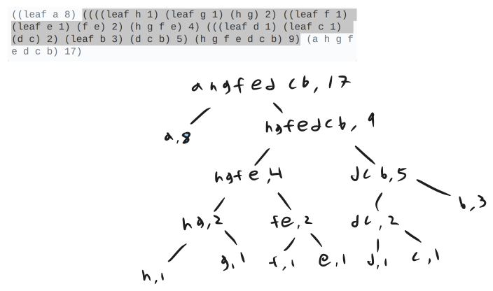

<div class="nav">
    <span class="activenav"><a href="notes-ch2-2.html">← Previous</a></span>
    <span class="activenav"><a href="../index.html">↑ Up</a></span>
    <span class="activenav"><a href="notes-ch2-4.html">Next →</a></span>
</div>


[HTML Book Chapter 2.3 Link](https://sarabander.github.io/sicp/html/2_002e3.xhtml#g_t2_002e3)

@toc

## Section 2.3

### Introduction

### Note on my confusion with Wolfram Language

So far I have been able to identify WL expressions like `f[x,y]` 
with LISP expressions `(f x y)`. But this nice correspondence is slightly 
broken in this chapter. 

In Mathematica, `List[Quote[a],Quote[b],Quote[c]]` is different from `Quote[List[a,b,c]]` (you could compare them using `===`).

But in Scheme, it appears `(list 'a 'b 'c)` and `'(a b c)` are the same (compare with `equal?`).

If we had the perfect correspondence

`(f x y)` <=> `f[x,y]`

Then I would assume quoting might give something like this:

`'(f x y)` <=> `"f"["x","y"]` (because `"f[x,y]"` seems too boring)

But in fact it seems like the correspondence is more akin to:

`'(f x y)` <=> `List["f","x","y"]`.

This might be the first thing that is a strict difference in convention between WL and Lisp.

*Note to reader:* I'm not sure of this! Those are just my thoughts while learning.

@src(code/ex2-53b.rkt)

@src(code/ex2-53b.wl)

Silly aside about @@:

@src(code/ex2-53c.rkt)

Tamwile in twitch chat says this is the equivalent in prolog:

```prolog
% Request to prolog.
?- foo(X,Y) =.. [Head|Tail], New =.. [bar|Tail].
% Answer of prolog
   Head = foo, Tail = [X,Y], New = bar(X,Y).
```

### Experimenting w/ derivatives

@src(code/symbolic-deriv.rkt)

### Exercises

#### Exercise 2.53

What would the interpreter print
in response to evaluating each of the following expressions?

```rkt
(list 'a 'b 'c)
(list (list 'george))
(cdr '((x1 x2) (y1 y2)))
(cadr '((x1 x2) (y1 y2)))
(pair? (car '(a short list)))
(memq 'red '((red shoes) (blue socks)))
(memq 'red '(red shoes blue socks))
```

##### Solution

@src(code/ex2-53.rkt)

#### Exercise 2.54

Two lists are said to be
`equal?` if they contain equal elements arranged in the same order.  For
example,

```rkt
(equal? '(this is a list) 
        '(this is a list))
```


is true, but

```rkt
(equal? '(this is a list) 
        '(this (is a) list))
```


is false.  To be more precise, we can define `equal?`  recursively in
terms of the basic `eq?` equality of symbols by saying that `a` and
`b` are `equal?` if they are both symbols and the symbols are
`eq?`, or if they are both lists such that `(car a)` is `equal?`
to `(car b)` and `(cdr a)` is `equal?` to `(cdr b)`.  Using
this idea, implement `equal?` as a procedure.

##### Solution

@src(code/ex2-54.rkt)

This bugs me, because it will fail when comparing non-symbol lists like
`(equal? (list 1 2 3) (list 1 2 3))`. But we're doing what the problems says
so let's just move on.

#### Exercise 2.55

Eva Lu Ator types to the interpreter the expression

```rkt
(car ''abracadabra)
```

To her surprise, the interpreter prints back `quote`.  Explain.

##### Solution
We have `(quote (quote abracadabra))` in the inner expression.
The first quote is evaluated leaving the inner expression
`(list 'quote 'abracadabra)`. Of course the car of this is `'quote`!

#### Exercise 2.56

Show how to extend the basic
differentiator to handle more kinds of expressions.  For instance, implement
the differentiation rule

$${d(u^{\kern0.1ex n}) \over dx} \,=\, {nu^{\kern0.1ex n-1} \, {du \over dx}}  $$


by adding a new clause to the `deriv` program and defining appropriate
procedures `exponentiation?`, `base`, `exponent`, and
`make-exponentiation`.  (You may use the symbol `**` to denote
exponentiation.)  Build in the rules that anything raised to the power 0 is 1
and anything raised to the power 1 is the thing itself.

##### Solution

Differentiation with respect to something in the exponent will be incorrect silently! (We'd need logs)

@src(code/ex2-56.rkt)

#### Exercise 2.57

Extend the differentiation
program to handle sums and products of arbitrary numbers of (two or more)
terms.  Then the last example above could be expressed as

```rkt
(deriv '(* x y (+ x 3)) 'x)
```

Try to do this by changing only the representation for sums and products,
without changing the `deriv` procedure at all.  For example, the
`addend` of a sum would be the first term, and the `augend` would be
the sum of the rest of the terms.

##### Solution

Some stuff we're not going to handle:

 - `make-sum` and `make-product` with multiple arguments and dotted tail notation,
 - Sorting expressions. ie without too much work we could automatically simplify
`(+ (* x 2) (* 2 y))` by sorting arguments and combining when equal.

@src(code/ex2-57.rkt)

#### Exercise 2.58

Suppose we want to modify the
differentiation program so that it works with ordinary mathematical notation,
in which `+` and `*` are infix rather than prefix operators.  Since
the differentiation program is defined in terms of abstract data, we can modify
it to work with different representations of expressions solely by changing the
predicates, selectors, and constructors that define the representation of the
algebraic expressions on which the differentiator is to operate.

**1.** Show how to do this in order to differentiate algebraic expressions presented
in infix form, such as `(x + (3 * (x + (y + 2))))`.  To simplify the task,
assume that `+` and `*` always take two arguments and that
expressions are fully parenthesized.

**2.** The problem becomes substantially harder if we allow standard algebraic
notation, such as `(x + 3 * (x + y + 2))`, which drops unnecessary
parentheses and assumes that multiplication is done before addition.  Can you
design appropriate predicates, selectors, and constructors for this notation
such that our derivative program still works?

##### Solution

For part 1, it's easy, we just have to adjust `make-***` and `augend,addend,multiplier,multiplicand`. 

@src(code/ex2-58.rkt)

For part 2, we can definitely just modify the accessors to get the correct results.

@src(code/ex2-58b.rkt)

<!-- For part 2, One way we can easily do this is: On the top level of a list, make a list of all summands and recurse `(deriv term sym)`. If there are no sums. make a list of all products and recurse in the more complicated product rule form. -->


#### Exercise 2.59

Implement the `union-set`
operation for the unordered-list representation of sets.

##### Solution

My impl reverses the order of elements, which is ugly, but whatever.

@src(code/ex2-59.rkt)

#### Exercise 2.60

We specified that a set would be
represented as a list with no duplicates.  Now suppose we allow duplicates.
For instance, the set $\{1, 2, 3\}$ could be represented as the list `(2 3 2 1
3 2 2)`.  Design procedures `element-of-set?`, `adjoin-set`,
`union-set`, and `intersection-set` that operate on this
representation.  How does the efficiency of each compare with the corresponding
procedure for the non-duplicate representation?  Are there applications for
which you would use this representation in preference to the non-duplicate one?

##### Solution

@src(code/ex2-60.rkt)

#### Exercise 2.61

Give an implementation of
`adjoin-set` using the ordered representation.  By analogy with
`element-of-set?` show how to take advantage of the ordering to produce a
procedure that requires on the average about half as many steps as with the
unordered representation.

##### Solution

@src(code/ex2-61.rkt)

#### Exercise 2.62

Give a $\Theta(n)$
implementation of `union-set` for sets represented as ordered lists.

##### Solution

@src(code/ex2-62.rkt)

#### Exercise 2.63

Each of the following two
procedures converts a binary tree to a list.

```rkt
(define (tree->list-1 tree)
  (if (null? tree)
      '()
      (append 
       (tree->list-1 
        (left-branch tree))
       (cons (entry tree)
             (tree->list-1 
              (right-branch tree))))))

(define (tree->list-2 tree)
  (define (copy-to-list tree result-list)
    (if (null? tree)
        result-list
        (copy-to-list 
         (left-branch tree)
         (cons (entry tree)
               (copy-to-list 
                (right-branch tree)
                result-list)))))
  (copy-to-list tree '()))
```

**1.** Do the two procedures produce the same result for every tree?  If not, how do
the results differ?  What lists do the two procedures produce for the trees in
Figure 2.16?

**2.** Do the two procedures have the same order of growth in the number of steps
required to convert a balanced tree with $n$ elements to a list?  If not,
which one grows more slowly?

##### Solution

An animation of these algorithms would be nice!

1. They both produce the same result for every tree. The implementation below constructs
the different trees and demonstrates this.
2. The two procedures don't have the same order of growth. The second algorithm is $\Theta(n)$ where $n$ is the number of nodes. The issue with the first algorithm is the append operation,
which first has to traverse a linked list before appending the second list. This sets up a bit 
of a weird recursion. For a perfectly balanced tree, I first thought this is $\Theta(n^2)$ where
$n$ is the number of nodes, but in fact it's $\Theta(n\log(n))$. We can set up a recursion:

The time taken for a tree, $T(\text{tree})$ is the sum of...
 - the time taken to append the left tree, $\textrm{Length}(\textrm{left-tree})$
 - the time taken to construct the left tree, $T(\textrm{left-tree})$
 - the time taken to construct the right tree, $T(\textrm{right-tree})$

So 
$$T(\textrm{tree})=\textrm{Length}(\textrm{left-tree})+T(\textrm{left-tree})+T(\textrm{right-tree})$$

For a perfectly balanced tree of length n, this gives recursion
$$T(n)=\frac{n}{2}+2T(\frac{n}{2})$$
Whose solution is $T(n)=\Theta(n\log(n))$

@src(code/ex2-63.rkt)

#### Exercise 2.64

The following procedure
`list->tree` converts an ordered list to a balanced binary tree.  The
helper procedure `partial-tree` takes as arguments an integer $n$ and
list of at least $n$ elements and constructs a balanced tree containing the
first $n$ elements of the list.  The result returned by `partial-tree`
is a pair (formed with `cons`) whose `car` is the constructed tree
and whose `cdr` is the list of elements not included in the tree.

```rkt
(define (list->tree elements)
  (car (partial-tree 
        elements (length elements))))

(define (partial-tree elts n)
  (if (= n 0)
      (cons '() elts)
      (let ((left-size 
             (quotient (- n 1) 2)))
        (let ((left-result 
               (partial-tree 
                elts left-size)))
          (let ((left-tree 
                 (car left-result))
                (non-left-elts 
                 (cdr left-result))
                (right-size 
                 (- n (+ left-size 1))))
            (let ((this-entry 
                   (car non-left-elts))
                  (right-result 
                   (partial-tree 
                    (cdr non-left-elts)
                    right-size)))
              (let ((right-tree 
                     (car right-result))
                    (remaining-elts 
                     (cdr right-result)))
                (cons (make-tree this-entry 
                                 left-tree 
                                 right-tree)
                      remaining-elts))))))))
```

**1.** Write a short paragraph explaining as clearly as you can how
`partial-tree` works.  Draw the tree produced by `list->tree` for
the list `(1 3 5 7 9 11)`.

**2.** What is the order of growth in the number of steps required by
`list->tree` to convert a list of $n$ elements?


##### Solution

The key is that we want to be able to write this line:
```rkt
(cons (make-tree this-entry
       left-tree
       right-tree)
 remaining-elts)
```
In Javascript we'd use something like `.slice()` to get the first ~n/2
elements, the middle element, and the last ~n/2 elements. The purpose of the 
remaining-elts list basically implements this slicing in a clever way.

For question 2, we don't have any calls to things like `length` or `append` 
in our recursion. So our growth should just be linear.

#### Exercise 2.65

Use the results of Exercise 2.63 
and Exercise 2.64 to give $\Theta(n)$ implementations of
`union-set` and `intersection-set` for sets implemented as (balanced)
binary trees.

##### Solution

We can just combine our previous algorithms:

```rkt
(define (union-set-tree set1 set2)
  (list->tree (union-set
               (tree->list set1) 
               (tree->list set2))))
(define (intersection-set-tree set1 set2)
  (list->tree (intersection-set 
               (tree->list set1)
               (tree->list set2))))
```

#### Exercise 2.66

Implement the `lookup`
procedure for the case where the set of records is structured as a binary tree,
ordered by the numerical values of the keys.

##### Solution


We'll assume we have the same functions like `entry, left-branch, right-branch`.

```rkt
(define (lookup given-key records)
  (cond ((null? records) false)
        ((= given-key (key (entry records))) (entry record))
        ((< given-key (key (entry records)))
         (lookup given-key (left-branch records)))
        ((> given-key (key (entry records)))
         (lookup given-key (key (right-branch records))))))
```

#### Exercise 2.67

Define an encoding tree and a
sample message:

```rkt
(define sample-tree
  (make-code-tree 
   (make-leaf 'A 4)
   (make-code-tree
    (make-leaf 'B 2)
    (make-code-tree 
     (make-leaf 'D 1)
     (make-leaf 'C 1)))))

(define sample-message 
  '(0 1 1 0 0 1 0 1 0 1 1 1 0))
```

Use the `decode` procedure to decode the message, and give the result.

##### Solution

`(A D A B B C A)`

@src(code/ex2-67.rkt)


#### Exercise 2.68

The `encode` procedure takes
as arguments a message and a tree and produces the list of bits that gives the
encoded message.

```rkt
(define (encode message tree)
  (if (null? message)
      '()
      (append 
       (encode-symbol (car message) 
                      tree)
       (encode (cdr message) tree))))
```

`Encode-symbol` is a procedure, which you must write, that returns the
list of bits that encodes a given symbol according to a given tree.  You should
design `encode-symbol` so that it signals an error if the symbol is not in
the tree at all.  Test your procedure by encoding the result you obtained in
Exercise 2.67 with the sample tree and seeing whether it is the same as
the original sample message.

##### Solution

Encoding the decoded message returns the correct thing.

@src(code/ex2-68.rkt)

#### Exercise 2.69

The following procedure takes as
its argument a list of symbol-frequency pairs (where no symbol appears in more
than one pair) and generates a Huffman encoding tree according to the Huffman
algorithm.

```rkt
(define (generate-huffman-tree pairs)
  (successive-merge 
   (make-leaf-set pairs)))
```

`Make-leaf-set` is the procedure given above that transforms the list of
pairs into an ordered set of leaves.  `Successive-merge` is the procedure
you must write, using `make-code-tree` to successively merge the
smallest-weight elements of the set until there is only one element left, which
is the desired Huffman tree.  (This procedure is slightly tricky, but not
really complicated.  If you find yourself designing a complex procedure, then
you are almost certainly doing something wrong.  You can take significant
advantage of the fact that we are using an ordered set representation.)

##### Solution

@src(code/ex2-69.rkt)

After staring long enough, this tree is not quite the same as the one given earlier in the chapter (for example `b` is encoded as `111` instead of `100`), but that's fine.
<div style="text-align: center; margin: 20px 0;">
  
</div>

#### Exercise 2.70
The following eight-symbol
alphabet with associated relative frequencies was designed to efficiently
encode the lyrics of 1950s rock songs.  (Note that the ``symbols'' of an
``alphabet'' need not be individual letters.)

<table>
  <tr><td>A</td><td>2</td><td>NA</td><td>16</td></tr>
  <tr><td>BOOM</td><td>1</td><td>SHA</td><td>3</td></tr>
  <tr><td>GET</td><td>2</td><td>YIP</td><td>9</td></tr>
  <tr><td>JOB</td><td>2</td><td>WAH</td><td>1</td></tr>
</table>

Use `generate-huffman-tree` (Exercise 2.69) to generate a
corresponding Huffman tree, and use `encode` (Exercise 2.68) to
encode the following message:

```
Get a job
Sha na na na na na na na na

Get a job
Sha na na na na na na na na

Wah yip yip yip yip 
yip yip yip yip yip
Sha boom
```

How many bits are required for the encoding?  What is the smallest number of
bits that would be needed to encode this song if we used a fixed-length code
for the eight-symbol alphabet?

##### Solution

@src(code/ex2-70.rkt)

#### Exercise 2.71

Suppose we have a Huffman tree
for an alphabet of $n$ symbols, and that the relative frequencies of the
symbols are $1, 2, 4, \dots, 2^{n-1}$.  Sketch the tree for $n=5$; for
$n=10$.  In such a tree (for general $n$) how many bits are required to
encode the most frequent symbol?  The least frequent symbol?

##### Solution
In my implementation it's a left-heavy tree, $2^{n-1}$ is encoded as `1`, 
0 (with a frequency of $2^0=1$) is encoded as $0\ldots 0$. 

@src(code/ex2-71.rkt)

#### Exercise 2.72

Consider the encoding procedure
that you designed in Exercise 2.68.  What is the order of growth in the
number of steps needed to encode a symbol?  Be sure to include the number of
steps needed to search the symbol list at each node encountered.  To answer
this question in general is difficult.  Consider the special case where the
relative frequencies of the $n$ symbols are as described in Exercise 2.71, 
and give the order of growth (as a function of $n$) of the number of
steps needed to encode the most frequent and least frequent symbols in the
alphabet.

##### Solution

For encoding the most common symbol, it's actually going to be $\Theta(n)$
specifically because of the element checking in the line:
```rkt
(element-of-list? symbol (symbols (left-branch tree)))
```

For encoding the least common symbol, I could have been fancy and sorted the symbols list during construction, so that each lookup would also be $\Theta(1)$ 
(it would be the first symbol tested). But if I assume the symbols are in a random order, each lookup will be $\Theta(n)$. We have to do $n$ of these, so 
in fact this is a worst case situation, and the encoding is $\Theta(n^2)$! 

If we're encoding symbol $k$, on the first step we search a list of size
$n-1$, then $n-2$, ... to $n-k$. This is 
$$\sum_{i=1}^k (n-i) = \frac{k (2n-1-k)}{2}$$

If each $k$ is weighted by $2^{n-k-1}$ (meaning, the symbol with $k=0$ 
has frequency $2^{n-1}$) then the expectation value is...

```mathematica
In[29]:= 
  weight[k_] = 2^(n - k - 1);
  P[k_] = weight[k]/Sum[weight[k], {k, 0, n - 1}];
  Sum[-(1/2) k (1 + k - 2 n) P[k], {k, 0, n - 1}] // FullSimplify

Out[31]= -2 + n - ((-3 + n) n)/(2 (-1 + 2^n))
```
Which means that we have an expected encoding time of order $\Theta(n)$, 
but the worst case encoding time is $\Theta(n^2)$.


<!--
$n$ is the number of symbols. 
Let's look at my impl of successive-merge. 
For the tree in exercise 2.71, `car tree-list` contains the rest of the tree
and `cadr tree-list` contains the current leaf.

```
(define (successive-merge tree-list) 
  (if (= 1 (length tree-list)) (car tree-list)
    (let ((a (car tree-list)) 
          (b (cadr tree-list)) 
          (rest (cddr tree-list)))
      (successive-merge (adjoin-set (make-code-tree a b) rest)))))
```

The time taken to execute successive-merge will depend on the number of 
symbols in the list. Each time we call adjoin, we decrease the number of 
symbols by one. In fact the very special form of the frequencies means we
never have to worry about re-sorting the list; we expect adjoin-set to always
append at the beginning. This is because when we adjoin frequencies (1+2), this 
is still less than 4. Frequencies (1+2+4) is less than 8, and so on. 
So adjoin-set is going to be O(1) in all cases.

So this is easy, it's just $\Theta(n)$ to build the tree, 
-->


