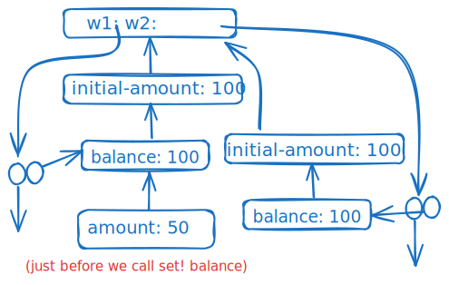
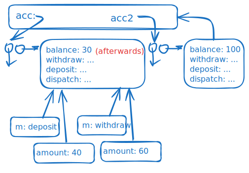

<div class="nav">
    <span class="activenav"><a href="notes-ch3-1.html">← Previous</a></span>
    <span class="activenav"><a href="../index.html">↑ Up</a></span>
    <span class="activenav"><a href="notes-ch3-3.html">Next →</a></span>
</div>


[HTML Book Chapter 3.2 Link](https://sarabander.github.io/sicp/html/3_002e2.xhtml#g_t3_002e2)

@toc

## Section 3.2

### Notes

**Definition of a frame.** A frame is a table (dictionary) of bindings
which associate variable names to their values, along with a 
pointer to its enclosing environment. A single frame may 
contain at most one binding for any variable. 

An environment is a sequence of frames.

Each frame is a table of bindings.

Each binding associates variable names with their corresponding values.

`define` creates definitions by adding bindings to frames.


Note from chat: How do we write recursive lambdas anyways? rcr points out
`auto factorial = []() { ... factorial(...); ... }` fails in C++. 

### Meeting 05-18-2025

Environment and frame distinction: This is a bit confusing, but the definition
in the book can be taken at face value:

> An environment is a sequence of frames. Each frame is a table (possibly empty) of bindings, which associate variable names with their corresponding values. (A single frame may contain at most one binding for any variable.) Each frame also has a pointer to its enclosing environment, unless, for the purposes of discussion, the frame is considered to be global.

At first I thought that "each frame also has a pointer to the next frame in
the sequence of frames" would be a better definition, and I still think of 
each frame as storing a pointer to a frame rather than a pointer to an 
environment (this matches the diagrams better anyways, where frames point to other frames), but I suppose that the pointer-to-frame can be considered to be an "environment". 

Some notes from our conversation:

 - Because it's so easy to confuse terms, it's probably best to watch the video
chapters corresponding to this course! Ie [the 1986 MIT lectures](https://www.youtube.com/watch?v=jl8EHP1WrWY) or [Spring 2010 Berkeley](https://www.youtube.com/watch?v=fSjVM0rHrMQ).

 - All function calls will create frames, but special forms don't! So, `if` doesn't, for example. Gerry calls this out in his 1986 lecture.
 - We had a discussion about how to create deeply nested frames (or "deeply chained" frames). The way to do this isn't to call a procedure a bunch, but instead to declare lambdas-within-lambdas-within-lambdas. Calling a procedure a bunch will just create many frames which refer to the frame in which the procedure was defined, not a deep nesting.
 - Lexical scope vs dynamic scope. It was mentioned that Mathematica is 
dynamically scoped, with tools for lexical 
scoping using `Block[]` and `Module[]` I've
never thought about this from a deep systems / language POV before. An analogy
I drew but I should be cautious of: dynamic scoping might be more like
referencing a javascript object `var global;` to dynamically add and remove
symbols from it. This issue of whether a symbol is defined is a matter of
whether global[symbol] is undefined at a given time.
 - Note that my first instinct on drawing the fibonacci procedure was wrong,
I drew deeply nested environments but in fact it's 6 different environments
and the tree is shallow and wide not narrow and deep.


More stuff on Lisp compilers:

 - https://en.wikipedia.org/wiki/Self-hosting_(compilers)
 - https://www.paulgraham.com/lisphistory.html ("at least read [history of T](https://www.paulgraham.com/thist.html)") (adjacent: https://www.paulgraham.com/hp.html )
 - https://www.sbcl.org/porting.html
 - https://texdraft.github.io/
 - https://norvig.com/lispy.html
 - https://gchandbook.org/

### Exercises

#### Exercise 3.9

In 1.2.1 we used the
substitution model to analyze two procedures for computing factorials, a
recursive version

```rkt
(define (factorial n)
  (if (= n 1)
      1
      (* n (factorial (- n 1)))))
```

and an iterative version

```rkt
(define (factorial n)
  (fact-iter 1 1 n))

(define (fact-iter product 
                   counter 
                   max-count)
  (if (> counter max-count)
      product
      (fact-iter (* counter product)
                 (+ counter 1)
                 max-count)))
```

Show the environment structures created by evaluating `(factorial 6)`
using each version of the `factorial` procedure.

##### Solution


```txt
factorial E1: n:6
factorial E2: n:5
factorial E3: n:4
factorial E4: n:3
factorial E5: n:2
factorial E6: n:1
```

```txt
factorial E1: n:6
fact-iter E2: product: 1, counter: 1, n: 6
fact-iter E3: product: 1, counter: 2, n: 6
fact-iter E4: product: 2, counter: 3, n: 6
fact-iter E5: product: 6, counter: 4, n: 6
fact-iter E6: product: 24 counter: 5, n: 6
fact-iter E7: product: 120 counter: 6, n: 6
fact-iter E8: product: 720 counter: 7, n: 6
```

#### Exercise 3.10

In the `make-withdraw`
procedure, the local variable `balance` is created as a parameter of
`make-withdraw`.  We could also create the local state variable
explicitly, using `let`, as follows:

```rkt
(define (make-withdraw initial-amount)
  (let ((balance initial-amount))
    (lambda (amount)
      (if (>= balance amount)
          (begin (set! balance 
                       (- balance amount))
                 balance)
          "Insufficient funds"))))
```

Recall from 1.3.2 that `let` is simply syntactic sugar for a
procedure call:

```rkt
(let ((⟨var⟩ ⟨exp⟩)) ⟨body⟩)
```


is interpreted as an alternate syntax for

```rkt
((lambda (⟨var⟩) ⟨body⟩) ⟨exp⟩)
```

Use the environment model to analyze this alternate version of
`make-withdraw`, drawing figures like the ones above to illustrate the
interactions

```rkt
(define W1 (make-withdraw 100))
(W1 50)
(define W2 (make-withdraw 100))
```

Show that the two versions of `make-withdraw` create objects with the same
behavior.  How do the environment structures differ for the two versions?

##### Solution
<div style="text-align: center; margin: 20px 0;">
  
</div>

#### Exercise 3.11

In 3.2.3 we saw how
the environment model described the behavior of procedures with local state.
Now we have seen how internal definitions work.  A typical message-passing
procedure contains both of these aspects.  Consider the bank account procedure
of 3.1.1:

```rkt
(define (make-account balance)
  (define (withdraw amount)
    (if (>= balance amount)
        (begin (set! balance 
                     (- balance 
                        amount))
               balance)
        "Insufficient funds"))
  (define (deposit amount)
    (set! balance (+ balance amount))
    balance)
  (define (dispatch m)
    (cond ((eq? m 'withdraw) withdraw)
          ((eq? m 'deposit) deposit)
          (else (error "Unknown request: 
                        MAKE-ACCOUNT" 
                       m))))
  dispatch)
```

Show the environment structure generated by the sequence of interactions

```rkt
(define acc (make-account 50))

((acc 'deposit) 40)
90

((acc 'withdraw) 60)
30
```

Where is the local state for `acc` kept?  Suppose we define another
account

```rkt
(define acc2 (make-account 100))
```

How are the local states for the two accounts kept distinct?  Which parts of
the environment structure are shared between `acc` and `acc2`?

##### Solution
<div style="text-align: center; margin: 20px 0;">
  
</div>
