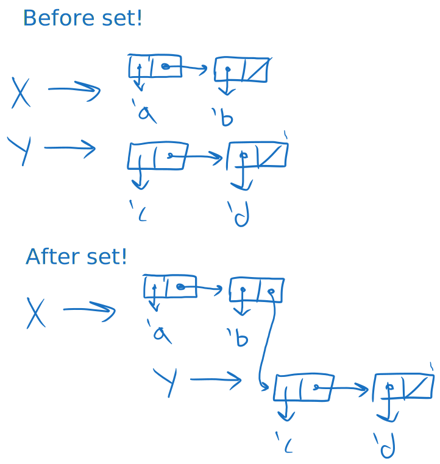
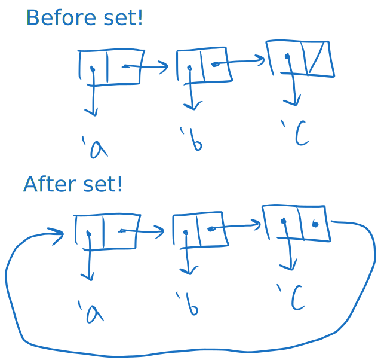
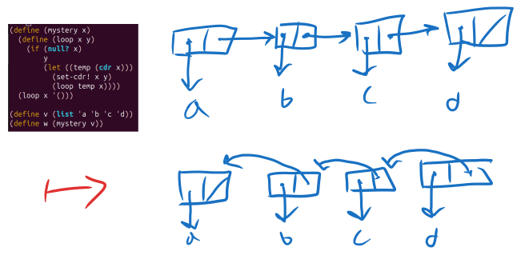
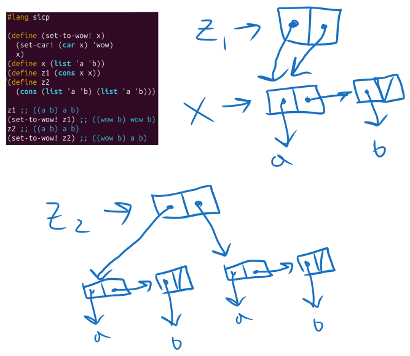
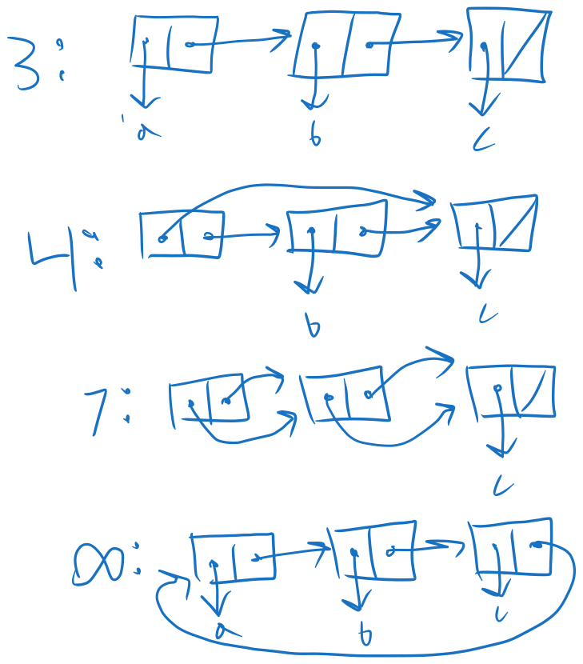
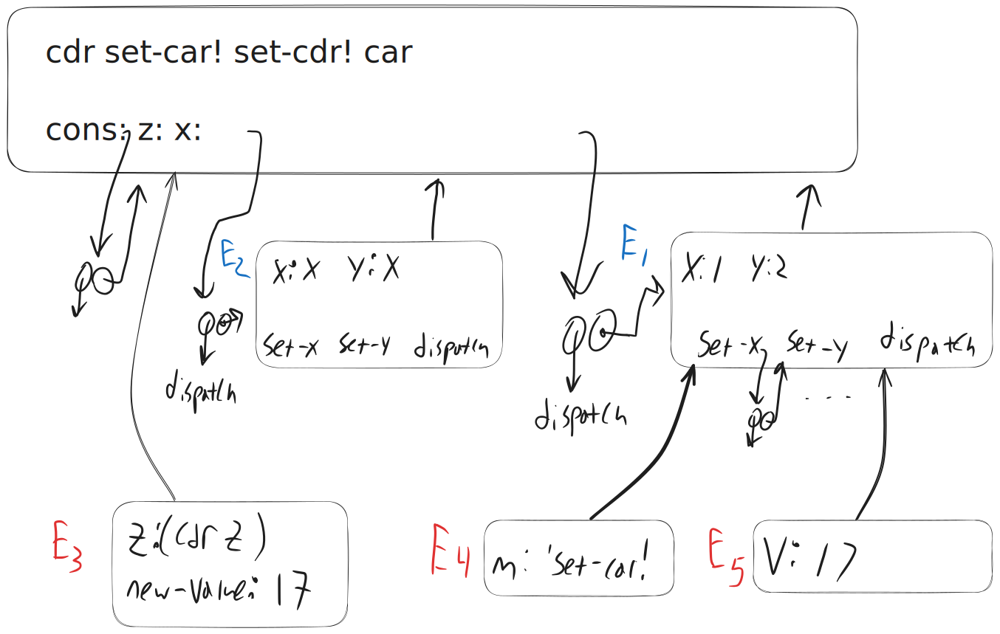
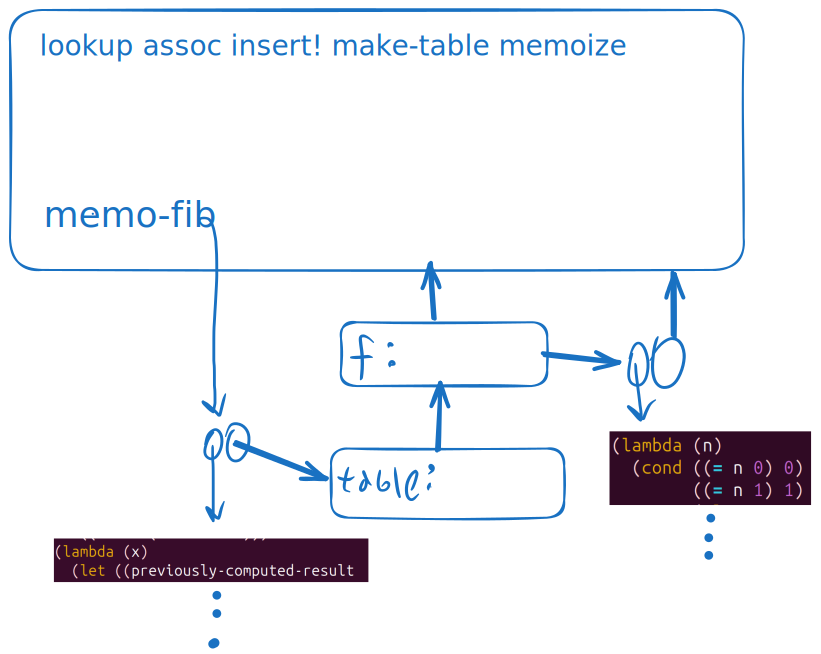

<div class="nav">
    <span class="activenav"><a href="notes-ch3-2.html">← Previous</a></span>
    <span class="activenav"><a href="../index.html">↑ Up</a></span>
    <span class="activenav"><a href="notes-ch3-4.html">Next →</a></span>
</div>


[HTML Book Chapter 3.3 Link](https://sarabander.github.io/sicp/html/3_002e3.xhtml#g_t3_002e3)

@toc

## Section 3.3

### Notes

@src(code/examples-3-3.rkt)

 - It would be nice to have a proof that we can't construct an (efficient) queue
without `set!`, or if that's true.


 - Impossibility of an efficient doubly linked list without mutability? 
(there was a conversation about doubly linked lists in Rust)

### Meeting 05-25-2025

- Eric Grimson 2004 MIT lectures on SICP [13. Environment Model](https://www.youtube.com/watch?v=SDsxFreEYsc&list=PL7BcsI5ueSNFPCEisbaoQ0kXIDX9rR5FF&t=1962s).
 - [From here to lambda and back again - Douglas Crockford at RacketCon](https://www.youtube.com/watch?v=vMDHpPN_p08)
 - p-list vs a-list
 - In the context of the end of chapter 3-3, constraint solvers: First order predicate and expert systems.

 - Note on one of the problems: Given the implementation of `append!`, I had to intialize a supposedly empty list to a dummy pair `(list dummy '())`. Specifically I was referring to the line `(define tracker (list 'first-element))` in my solution to [exercise 17](https://physbuzz.github.io/sicp/ch3/notes-ch3-3.html#exercise-317)
 - [Common lisp quick reference](http://clqr.boundp.org/)

### Exercises

#### Exercise 3.12

The following procedure for
appending lists was introduced in 2.2.1:

```rkt
(define (append x y)
  (if (null? x)
      y
      (cons (car x) (append (cdr x) y))))
```

`Append` forms a new list by successively `cons`ing the elements of
`x` onto `y`.  The procedure `append!` is similar to
`append`, but it is a mutator rather than a constructor.  It appends the
lists by splicing them together, modifying the final pair of `x` so that
its `cdr` is now `y`.  (It is an error to call `append!` with an
empty `x`.)

```rkt
(define (append! x y)
  (set-cdr! (last-pair x) y)
  x)
```

Here `last-pair` is a procedure that returns the last pair in its
argument:

```rkt
(define (last-pair x)
  (if (null? (cdr x))
      x
      (last-pair (cdr x))))
```

Consider the interaction

```rkt
(define x (list 'a 'b))
(define y (list 'c 'd))
(define z (append x y))

z
(a b c d)

(cdr x)
⟨response⟩

(define w (append! x y))

w
(a b c d)

(cdr x)
⟨response⟩
```

What are the missing `⟨response⟩`s?  Draw box-and-pointer diagrams to
explain your answer.

##### Solution

@src(code/ex3-12.rkt)

<div style="text-align: center; margin: 20px 0;">
  
</div>

#### Exercise 3.13

Consider the following
`make-cycle` procedure, which uses the `last-pair` procedure defined
in Exercise 3.12:

```rkt
(define (make-cycle x)
  (set-cdr! (last-pair x) x)
  x)
```

Draw a box-and-pointer diagram that shows the structure `z` created by

```rkt
(define z (make-cycle (list 'a 'b 'c)))
```

What happens if we try to compute `(last-pair z)`?

##### Solution

If we try to compute `(last-pair z)`, the algorithm will run
until it finds a pair which has a cdr equal to nil. Unfortunately this will never happen!

<div style="text-align: center; margin: 20px 0;">
  
</div>


#### Exercise 3.14

The following procedure is quite
useful, although obscure:

```rkt
(define (mystery x)
  (define (loop x y)
    (if (null? x)
        y
        (let ((temp (cdr x)))
          (set-cdr! x y)
          (loop temp x))))
  (loop x '()))
```

`Loop` uses the "temporary" variable `temp` to hold the old value
of the `cdr` of `x`, since the `set-cdr!`  on the next line
destroys the `cdr`.  Explain what `mystery` does in general.  Suppose
`v` is defined by `(define v (list 'a 'b 'c 'd))`. Draw the
box-and-pointer diagram that represents the list to which `v` is bound.
Suppose that we now evaluate `(define w (mystery v))`. Draw
box-and-pointer diagrams that show the structures `v` and `w` after
evaluating this expression.  What would be printed as the values of `v`
and `w`?

##### Solution

@src(code/ex3-14.rkt)

This is a recursive algorithm for reversing a linked list. One way to see this is
to look at the invariant `(append (reverse y) x)`, which will always be equal to
the original list. Certainly it's true for `y='()` and `x=list`. On subsequent steps,
we can look at the function call `(loop temp x-modified)` and work backwards 
(where I use `x-modified` to refer to x after being mutated with `set-cdr!`
```rkt
(append (reverse x-modified) temp)
=(append (reverse (cons (car x) y)) (cdr x))
=(append (reverse y) (cons (car x) (cdr x)))
=(append (reverse y) x)
```
So the loop invariant is preserved, the length of the first argument decreases by one
each step, and at the end when `x='()` we have `list = (reverse y)` so the list is reversed.

Less proof-ey, more intuitively, recall that every pair in the linked list has a pointer to the element stored
and a pointer to the next element stored. We want to change this second pointer 
to point towards the previous element in the list. We do this by storing 
the previous pair in the list as `y` and the rest of the not-updated list as `x`.

<div style="text-align: center; margin: 20px 0;">
  
</div>

#### Exercise 3.15

Draw box-and-pointer diagrams to
explain the effect of `set-to-wow!` on the structures `z1` and
`z2` above.

##### Solution
<div style="text-align: center; margin: 20px 0;">
  
</div>

So this explains why in the first case when we call `set-to-wow!` it seems like
"both pairs" are changed. In fact we are changing the first pair, x, and it is pointed to
twice.

In the case of `z2`, these point to two separate lists.

#### Exercise 3.16

Ben Bitdiddle decides to write a
procedure to count the number of pairs in any list structure.  ``It's easy,''
he reasons.  ``The number of pairs in any structure is the number in the
`car` plus the number in the `cdr` plus one more to count the current
pair.''  So Ben writes the following procedure:

```rkt
(define (count-pairs x)
  (if (not (pair? x))
      0
      (+ (count-pairs (car x))
         (count-pairs (cdr x))
         1)))
```

Show that this procedure is not correct.  In particular, draw box-and-pointer
diagrams representing list structures made up of exactly three pairs for which
Ben's procedure would return 3; return 4; return 7; never return at all.

##### Solution

@src(code/ex3-16.rkt)

The explanation of the construction of the four different lists is explained
in this image:

<div style="text-align: center; margin: 20px 0;">
  
</div>

#### Exercise 3.17

Devise a correct version of the
`count-pairs` procedure of Exercise 3.16 that returns the number of
distinct pairs in any structure.  (Hint: Traverse the structure, maintaining an
auxiliary data structure that is used to keep track of which pairs have already
been counted.)

##### Solution

@src(code/ex3-17.rkt)

#### Exercise 3.18

Write a procedure that examines a
list and determines whether it contains a cycle, that is, whether a program
that tried to find the end of the list by taking successive `cdr`s would
go into an infinite loop.  Exercise 3.13 constructed such lists.

##### Solution

@src(code/ex3-18.rkt)

#### Exercise 3.19

Redo Exercise 3.18 using an
algorithm that takes only a constant amount of space.  (This requires a very
clever idea.)

##### Solution

@src(code/ex3-19.rkt)

The idea here is to use two "racers", racer x takes one step every turn, 
racer y takes two steps. If racer y ever passes racer x, there's a loop. 

#### Exercise 3.20

Draw environment diagrams to
illustrate the evaluation of the sequence of expressions

```rkt
(define x (cons 1 2))
(define z (cons x x))

(set-car! (cdr z) 17)

(car x)
17
```


using the procedural implementation of pairs given above.  (Compare
Exercise 3.11.)

##### Solution

<div style="text-align: center; margin: 20px 0;">
  
</div>

Here's an incomplete answer to the question based on just some of the diagrams that I could have written.

The blue E1 and E2 are created by the calls to cons. 

The red environments are created by `set-car!`, `dispatch` and cons's version of 
`set-x!`. I ignore the small environments created by calling `(car z)`, which would involve another call to `dispatch`. 

#### Exercise 3.21

Ben Bitdiddle decides to test the
queue implementation described above.  He types in the procedures to the Lisp
interpreter and proceeds to try them out:

```rkt
(define q1 (make-queue))

(insert-queue! q1 'a)
((a) a)

(insert-queue! q1 'b)
((a b) b)

(delete-queue! q1)
((b) b)

(delete-queue! q1)
(() b)
```

"It's all wrong!" he complains.  "The interpreter's response shows that the
last item is inserted into the queue twice.  And when I delete both items, the
second `b` is still there, so the queue isn't empty, even though it's
supposed to be."  Eva Lu Ator suggests that Ben has misunderstood what is
happening. "It's not that the items are going into the queue twice," she
explains.  "It's just that the standard Lisp printer doesn't know how to make
sense of the queue representation. If you want to see the queue printed
correctly, you'll have to define your own print procedure for queues." Explain
what Eva Lu is talking about.  In particular, show why Ben's examples produce
the printed results that they do.  Define a procedure `print-queue` that
takes a queue as input and prints the sequence of items in the queue.

##### Solution

@src(code/ex3-21.rkt)

#### Exercise 3.22

Instead of representing a queue
as a pair of pointers, we can build a queue as a procedure with local state.
The local state will consist of pointers to the beginning and the end of an
ordinary list.  Thus, the `make-queue` procedure will have the form

```rkt
(define (make-queue)
  (let ((front-ptr … )
        (rear-ptr … ))
    ⟨@var{definitions of internal procedures}⟩
    (define (dispatch m) …)
    dispatch))
```

Complete the definition of `make-queue` and provide implementations of the
queue operations using this representation.

##### Solution

@src(code/ex3-22.rkt)

#### Exercise 3.23

A deque (`double-ended queue`) is a sequence in which items can be inserted and deleted at either the
front or the rear.  Operations on deques are the constructor `make-deque`,
the predicate `empty-deque?`, selectors `front-deque` and
`rear-deque`, and mutators `front-insert-deque!`,
`rear-insert-deque!`, `front-delete-deque!`, 
`rear-delete-deque!`.  Show how to represent deques using pairs, and give
implementations of the operations.  
All operations should be accomplished in $\Theta(1)$ steps.

##### Solution

We have to roll our own doubly linked list, I'll have the list of the form:

```rkt
'((el1 '()) (el2 prevptr2) ... (elN prevptrN))
```

We have to make sure that when we add an element on the end, prev-ptr
is updated appropriately, and when we delete an element from the beginning
the appropriate prev-ptr is set to `nil`.

@src(code/ex3-23.rkt)

#### Exercise 3.24

In the table implementations
above, the keys are tested for equality using `equal?` (called by
`assoc`).  This is not always the appropriate test.  For instance, we
might have a table with numeric keys in which we don't need an exact match to
the number we're looking up, but only a number within some tolerance of it.
Design a table constructor `make-table` that takes as an argument a
`same-key?` procedure that will be used to test "equality" of keys.
`Make-table` should return a `dispatch` procedure that can be used to
access appropriate `lookup` and `insert!` procedures for a local
table.

##### Solution

@src(code/ex3-24.rkt)

#### Exercise 3.25

Generalizing one- and
two-dimensional tables, show how to implement a table in which values are
stored under an arbitrary number of keys and different values may be stored
under different numbers of keys.  The `lookup` and `insert!`
procedures should take as input a list of keys used to access the table.

##### Solution

#### Exercise 3.26

To search a table as implemented
above, one needs to scan through the list of records.  This is basically the
unordered list representation of 2.3.3.  For large tables, it may
be more efficient to structure the table in a different manner.  Describe a
table implementation where the (key, value) records are organized using a
binary tree, assuming that keys can be ordered in some way (e.g., numerically
or alphabetically).  (Compare Exercise 2.66 of Chapter 2.)

##### Solution

This is a straightforward application of the binary trees we developed in chapter 2. There, the lookup pseudocode for [problem 2.66](../ch2/notes-ch2-3.html#exercise-266) was...

```rkt
(define (lookup given-key records)
  (cond ((null? records) false)
        ((= given-key (key (entry records))) (entry record))
        ((< given-key (key (entry records)))
         (lookup given-key (left-branch records)))
        ((> given-key (key (entry records)))
         (lookup given-key (key (right-branch records))))))
```

To get this to actually work we need an ordering on keys.
In Racket this can be done using `string<?` and `symbol->string`, 
I'm not sure if there's a better way. However, for example,
we used this to define a lexicographic ordering on 
monomials in [problem 2.92](../ch2/notes-ch2-5.html#exercise-292)


#### Exercise 3.27

Memoization (also
called tabulation) is a technique that enables a procedure to record,
in a local table, values that have previously been computed.  This technique
can make a vast difference in the performance of a program.  A memoized
procedure maintains a table in which values of previous calls are stored using
as keys the arguments that produced the values.  When the memoized procedure is
asked to compute a value, it first checks the table to see if the value is
already there and, if so, just returns that value.  Otherwise, it computes the
new value in the ordinary way and stores this in the table.  As an example of
memoization, recall from 1.2.2 the exponential process for
computing Fibonacci numbers:

```rkt
(define (fib n)
  (cond ((= n 0) 0)
        ((= n 1) 1)
        (else (+ (fib (- n 1))
                 (fib (- n 2))))))
```

The memoized version of the same procedure is

```rkt
(define memo-fib
  (memoize 
   (lambda (n)
     (cond ((= n 0) 0)
           ((= n 1) 1)
           (else 
            (+ (memo-fib (- n 1))
               (memo-fib (- n 2))))))))
```


where the memoizer is defined as

```rkt
(define (memoize f)
  (let ((table (make-table)))
    (lambda (x)
      (let ((previously-computed-result 
             (lookup x table)))
        (or previously-computed-result
            (let ((result (f x)))
              (insert! x result table)
              result))))))
```

Draw an environment diagram to analyze the computation of `(memo-fib 3)`.
Explain why `memo-fib` computes the $n^{\text{th}}$ Fibonacci number in a number
of steps proportional to $n$.  Would the scheme still work if we had simply
defined `memo-fib` to be `(memoize fib)`?

##### Solution

@src(code/ex3-27.rkt)

<div style="text-align: center; margin: 20px 0;">
  
</div>

`memo-fib` computes each value at most once, and after this value is cached
it will simply be looked up the next time. 

I don't go into detail about all of the little environments created after
evaluating fib n, but you can find a good diagram here:

[https://github.com/kana/sicp/blob/master/ex-3.27.md](https://github.com/kana/sicp/blob/master/ex-3.27.md)

#### Exercise 3.28

Define an or-gate as a primitive
function box.  Your `or-gate` constructor should be similar to
`and-gate`.

##### Solution

#### Exercise 3.29

Another way to construct an
or-gate is as a compound digital logic device, built from and-gates and
inverters.  Define a procedure `or-gate` that accomplishes this.  What is
the delay time of the or-gate in terms of `and-gate-delay` and
`inverter-delay`?

##### Solution

#### Exercise 3.30

Figure 3.27 shows a
ripple-carry adder formed by stringing together $n$ full-adders.
This is the simplest form of parallel adder for adding two $n$-bit binary
numbers.  The inputs $A_1$, $A_2$, $A_3$, @dots{}, $A_n$ and 
$B_1$, $B_2$, $B_3$,
@dots{}, $B_n$ are the two binary numbers to be added (each $A_k$ and
$B_k$ is a 0 or a 1).  The circuit generates $S_1$, $S_2$, 
$S_3$, @dots{}, $S_n$,
the $n$ bits of the sum, and $C$, the carry from the addition.  Write a
procedure `ripple-carry-adder` that generates this circuit.  The procedure
should take as arguments three lists of $n$ wires each---the $A_k$, the
$B_k$, and the $S_k$---and also another wire $C$.  The major drawback of the
ripple-carry adder is the need to wait for the carry signals to propagate.
What is the delay needed to obtain the complete output from an $n$-bit
ripple-carry adder, expressed in terms of the delays for and-gates, or-gates,
and inverters?

##### Solution

#### Exercise 3.31

The internal procedure
`accept-action-procedure!` defined in `make-wire` specifies that when
a new action procedure is added to a wire, the procedure is immediately run.
Explain why this initialization is necessary.  In particular, trace through the
half-adder example in the paragraphs above and say how the system's response
would differ if we had defined `accept-action-procedure!` as

```rkt
(define (accept-action-procedure! proc)
  (set! action-procedures 
        (cons proc action-procedures)))
```

##### Solution

#### Exercise 3.32

The procedures to be run during
each time segment of the agenda are kept in a queue.  Thus, the procedures for
each segment are called in the order in which they were added to the agenda
(first in, first out).  Explain why this order must be used.  In particular,
trace the behavior of an and-gate whose inputs change from 0, 1 to 1, 0 in the
same segment and say how the behavior would differ if we stored a segment's
procedures in an ordinary list, adding and removing procedures only at the
front (last in, first out).

##### Solution

#### Exercise 3.33

Using primitive multiplier,
adder, and constant constraints, define a procedure `averager` that takes
three connectors `a`, `b`, and `c` as inputs and establishes the
constraint that the value of `c` is the average of the values of `a`
and `b`.

##### Solution

#### Exercise 3.34

Louis Reasoner wants to build a
squarer, a constraint device with two terminals such that the value of
connector `b` on the second terminal will always be the square of the
value `a` on the first terminal.  He proposes the following simple device
made from a multiplier:

```rkt
(define (squarer a b) (multiplier a a b))
```

There is a serious flaw in this idea.  Explain.

##### Solution

#### Exercise 3.35

Ben Bitdiddle tells Louis that
one way to avoid the trouble in Exercise 3.34 is to define a squarer as a
new primitive constraint.  Fill in the missing portions in Ben's outline for a
procedure to implement such a constraint:

```rkt
(define (squarer a b)
  (define (process-new-value)
    (if (has-value? b)
        (if (< (get-value b) 0)
            (error "square less than 0: 
                    SQUARER" 
                   (get-value b))
            ⟨@var{alternative1}⟩)
        ⟨@var{alternative2}⟩))
  (define (process-forget-value) ⟨@var{body1}⟩)
  (define (me request) ⟨@var{body2}⟩)
  ⟨@var{rest of definition}⟩
  me)
```

##### Solution

#### Exercise 3.36

Suppose we evaluate the following
sequence of expressions in the global environment:

```rkt
(define a (make-connector))
(define b (make-connector))
(set-value! a 10 'user)
```

At some time during evaluation of the `set-value!`, the following
expression from the connector's local procedure is evaluated:

```rkt
(for-each-except 
  setter inform-about-value constraints)
```

Draw an environment diagram showing the environment in which the above
expression is evaluated.

##### Solution

#### Exercise 3.37

The
`celsius-fahrenheit-converter` procedure is cumbersome when compared with
a more expression-oriented style of definition, such as

```rkt
(define (celsius-fahrenheit-converter x)
  (c+ (c* (c/ (cv 9) (cv 5))
          x)
      (cv 32)))

(define C (make-connector))
(define F (celsius-fahrenheit-converter C))
```

Here `c+`, `c*`, etc. are the ``constraint'' versions of the
arithmetic operations.  For example, `c+` takes two connectors as
arguments and returns a connector that is related to these by an adder
constraint:

```rkt
(define (c+ x y)
  (let ((z (make-connector)))
    (adder x y z)
    z))
```

Define analogous procedures `c-`, `c*`, `c/`, and `cv`
(constant value) that enable us to define compound constraints as in the
converter example above.

##### Solution

