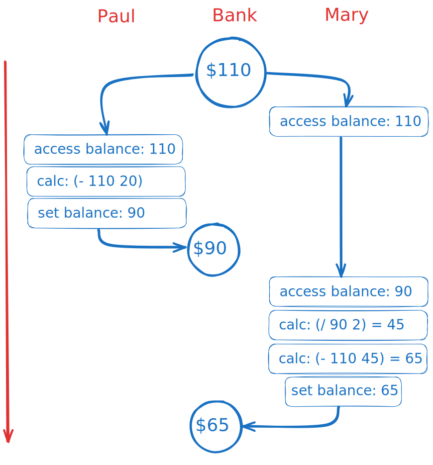

<div class="nav">
    <span class="activenav"><a href="notes-ch3-3.html">← Previous</a></span>
    <span class="activenav"><a href="../index.html">↑ Up</a></span>
    <span class="activenav"><a href="notes-ch3-5.html">Next →</a></span>
</div>


[HTML Book Chapter 3.4 Link](https://sarabander.github.io/sicp/html/3_002e4.xhtml#g_t3_002e4)

@toc

## Section 3.4

### Notes

First thing I notice is that none of this is coding! So it'll be much
easier to make mistakes. --> should double check with online solutions.

### Exercises

#### Exercise 3.38

Suppose that Peter, Paul, and
Mary share a joint bank account that initially contains \$100.  Concurrently,
Peter deposits \$10, Paul withdraws \$20, and Mary withdraws half the money in
the account, by executing the following commands:

```
Peter: (set! balance (+ balance 10))
Paul:  (set! balance (- balance 20))
Mary:  (set! balance (- balance 
                        (/ balance 2)))
```

**1.** List all the different possible values for `balance` after these three
transactions have been completed, assuming that the banking system forces the
three processes to run sequentially in some order.

**2.** What are some other values that could be produced if the system allows the
processes to be interleaved?  Draw timing diagrams like the one in Figure 3.29 
to explain how these values can occur.

##### Solution

**Part 1.**

- Peter $\rightarrow$ Paul $\rightarrow$ Mary: $45$
- Paul $\rightarrow$ Peter $\rightarrow$ Mary: $45$
- Mary $\rightarrow$ Paul $\rightarrow$ Peter: $40$ 
- Mary $\rightarrow$ Peter $\rightarrow$ Paul: $40$
- Peter $\rightarrow$ Mary $\rightarrow$ Paul: $35$
- Paul $\rightarrow$ Mary $\rightarrow$ Peter: $50$

**Part 2.**

Suppose that first Peter executes, then Mary's first lookup to `balance`, then 
Paul executes, then Mary's second lookup to balance. We'll do
`(- 110 (/ 90 2))` which gives $65.$


Alternatively if Paul's code executes first, then then Mary's first lookup to `balance`, then Peter's code, then Mary's second lookup to balance. We get
`(- 80 (/ 90 2))` which gives $35.$

<div style="text-align: center; margin: 20px 0;">
  
</div>

#### Exercise 3.39

Which of the five possibilities
in the parallel execution shown above remain if we instead serialize execution
as follows:

```rkt
(define x 10)
(define s (make-serializer))
(parallel-execute 
  (lambda () 
    (set! x ((s (lambda () (* x x))))))
  (s (lambda () (set! x (+ x 1)))))
```

##### Solution


```rkt
(define x 10)
(define s (make-serializer))
(parallel-execute 
  (lambda () 
    (set! x ((s (lambda () (* x x))))))
  (s (lambda () (set! x (+ x 1)))))
```

#### Exercise 3.40

Give all possible values of
`x` that can result from executing

```rkt
(define x 10)
(parallel-execute 
 (lambda () (set! x (* x x)))
 (lambda () (set! x (* x x x))))
```

Which of these possibilities remain if we instead use serialized procedures:

```rkt
(define x 10)
(define s (make-serializer))
(parallel-execute 
 (s (lambda () (set! x (* x x))))
 (s (lambda () (set! x (* x x x)))))
```

##### Solution

#### Exercise 3.41

Ben Bitdiddle worries that it
would be better to implement the bank account as follows (where the commented
line has been changed):

```rkt
(define (make-account balance)
  (define (withdraw amount)
    (if (>= balance amount)
        (begin 
          (set! balance 
                (- balance amount))
          balance)
        "Insufficient funds"))
  (define (deposit amount)
    (set! balance (+ balance amount))
    balance)
  (let ((protected (make-serializer)))
    (define (dispatch m)
      (cond ((eq? m 'withdraw) 
             (protected withdraw))
            ((eq? m 'deposit) 
             (protected deposit))
            ((eq? m 'balance)
             ((protected 
                (lambda () 
                  balance)))) @r{; serialized}
            (else 
             (error 
              "Unknown request: 
               MAKE-ACCOUNT"
              m))))
    dispatch))
```


because allowing unserialized access to the bank balance can result in
anomalous behavior.  Do you agree?  Is there any scenario that demonstrates
Ben's concern?

##### Solution

#### Exercise 3.42

Ben Bitdiddle suggests that it's
a waste of time to create a new serialized procedure in response to every
`withdraw` and `deposit` message.  He says that `make-account`
could be changed so that the calls to `protected` are done outside the
`dispatch` procedure.  That is, an account would return the same
serialized procedure (which was created at the same time as the account) each
time it is asked for a withdrawal procedure.

```rkt
(define (make-account balance)
  (define (withdraw amount)
    (if (>= balance amount)
        (begin (set! balance 
                     (- balance amount))
               balance)
        "Insufficient funds"))
  (define (deposit amount)
    (set! balance (+ balance amount))
    balance)
  (let ((protected (make-serializer)))
    (let ((protected-withdraw 
           (protected withdraw))
          (protected-deposit 
           (protected deposit)))
      (define (dispatch m)
        (cond ((eq? m 'withdraw) 
               protected-withdraw)
              ((eq? m 'deposit) 
               protected-deposit)
              ((eq? m 'balance) 
               balance)
              (else 
               (error "Unknown request: 
                       MAKE-ACCOUNT"
                      m))))
      dispatch)))
```

Is this a safe change to make?  In particular, is there any difference in what
concurrency is allowed by these two versions of `make-account`?

##### Solution

#### Exercise 3.43

Suppose that the balances in
three accounts start out as \$10, \$20, and \$30, and that multiple processes run,
exchanging the balances in the accounts.  Argue that if the processes are run
sequentially, after any number of concurrent exchanges, the account balances
should be \$10, \$20, and \$30 in some order.  Draw a timing diagram like the one
in Figure 3.29 to show how this condition can be violated if the
exchanges are implemented using the first version of the account-exchange
program in this section.  On the other hand, argue that even with this
`exchange` program, the sum of the balances in the accounts will be
preserved.  Draw a timing diagram to show how even this condition would be
violated if we did not serialize the transactions on individual accounts.

##### Solution

#### Exercise 3.44

Consider the problem of
transferring an amount from one account to another.  Ben Bitdiddle claims that
this can be accomplished with the following procedure, even if there are
multiple people concurrently transferring money among multiple accounts, using
any account mechanism that serializes deposit and withdrawal transactions, for
example, the version of `make-account` in the text above.

```rkt
(define 
  (transfer from-account to-account amount)
  ((from-account 'withdraw) amount)
  ((to-account 'deposit) amount))
```

Louis Reasoner claims that there is a problem here, and that we need to use a
more sophisticated method, such as the one required for dealing with the
exchange problem.  Is Louis right?  If not, what is the essential difference
between the transfer problem and the exchange problem?  (You should assume that
the balance in `from-account` is at least `amount`.)

##### Solution

#### Exercise 3.45

Louis Reasoner thinks our
bank-account system is unnecessarily complex and error-prone now that deposits
and withdrawals aren't automatically serialized.  He suggests that
`make-account-and-serializer` should have exported the serializer (for use
by such procedures as `serialized-exchange`) in addition to (rather than
instead of) using it to serialize accounts and deposits as `make-account`
did.  He proposes to redefine accounts as follows:

```rkt
(define 
  (make-account-and-serializer balance)
  (define (withdraw amount)
    (if (>= balance amount)
        (begin (set! balance 
                     (- balance amount))
               balance)
        "Insufficient funds"))
  (define (deposit amount)
    (set! balance (+ balance amount))
    balance)
  (let ((balance-serializer 
         (make-serializer)))
    (define (dispatch m)
      (cond ((eq? m 'withdraw) 
             (balance-serializer withdraw))
            ((eq? m 'deposit) 
             (balance-serializer deposit))
            ((eq? m 'balance) 
             balance)
            ((eq? m 'serializer) 
             balance-serializer)
            (else (error "Unknown request: 
                          MAKE-ACCOUNT"
                         m))))
    dispatch))
```

Then deposits are handled as with the original `make-account`:

```rkt
(define (deposit account amount)
  ((account 'deposit) amount))
```

Explain what is wrong with Louis's reasoning.  In particular, consider what
happens when `serialized-exchange` is called.

##### Solution

#### Exercise 3.46

Suppose that we implement
`test-and-set!`  using an ordinary procedure as shown in the text, without
attempting to make the operation atomic.  Draw a timing diagram like the one in
Figure 3.29 to demonstrate how the mutex implementation can fail by
allowing two processes to acquire the mutex at the same time.

##### Solution

#### Exercise 3.47

A semaphore (of size $n$) is a
generalization of a mutex.  Like a mutex, a semaphore supports acquire and
release operations, but it is more general in that up to $n$ processes can
acquire it concurrently.  Additional processes that attempt to acquire the
semaphore must wait for release operations.  Give implementations of semaphores

**1.** in terms of mutexes

**2.** in terms of atomic `test-and-set!` operations.


##### Solution

#### Exercise 3.48

Explain in detail why the
deadlock-avoidance method described above, (i.e., the accounts are numbered,
and each process attempts to acquire the smaller-numbered account first) avoids
deadlock in the exchange problem.  Rewrite `serialized-exchange` to
incorporate this idea.  (You will also need to modify `make-account` so
that each account is created with a number, which can be accessed by sending an
appropriate message.)

##### Solution

#### Exercise 3.49

Give a scenario where the
deadlock-avoidance mechanism described above does not work.  (Hint: In the
exchange problem, each process knows in advance which accounts it will need to
get access to.  Consider a situation where a process must get access to some
shared resources before it can know which additional shared resources it will
require.)

##### Solution

